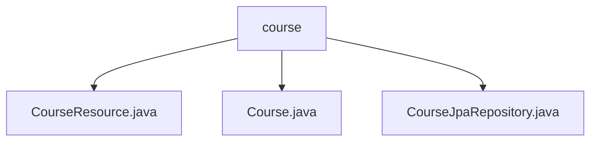

# 基础信息

|      |      |
|------|------|
| 名称 | course |
| 编码语言 | .java |
| 代码路径 | spring-boot-examples/spring-boot-react-examples/spring-boot-react-jpa-hibernate-with-h2-full-stack/backend-spring-boot-react-jpa-hibernate-with-h2-full-stack/src/main/java/com/in28minutes/fullstack/springboot/jpa/hibernate/springbootjpahibernatewithh2fullstack/course |
| 包名 | spring-boot-examples.spring-boot-react-examples.spring-boot-react-jpa-hibernate-with-h2-full-stack.backend-spring-boot-react-jpa-hibernate-with-h2-full-stack.src.main.java.com.in28minutes.fullstack.springboot.jpa.hibernate.springbootjpahibernatewithh2fullstack.course |
| 概述说明 | 控制器管理课程资源，支持跨域请求，提供增删改查功能。Course类含id、username、description属性，重写equals和hashCode方法。 |

# 说明

## 概述

该代码模块是一个基于Spring Boot和React的全栈应用程序的一部分，专门用于管理课程资源。模块包含三个主要组件：`CourseResource`控制器、`Course`实体类和`CourseJpaRepository`接口。`CourseResource`控制器负责处理与课程相关的HTTP请求，包括获取、创建、更新和删除课程。`Course`实体类定义了课程的基本属性（如`id`、`username`和`description`），并提供了构造方法、getter/setter方法以及重写的`equals`和`hashCode`方法，以确保对象的正确性和一致性。`CourseJpaRepository`接口则用于与数据库进行交互，提供课程数据的持久化操作。

## 主要业务场景

1. **课程管理**：通过`CourseResource`控制器，用户可以执行以下操作：
   - 获取课程信息：查询并返回特定课程或所有课程的详细信息。
   - 创建新课程：接收课程数据并存储到数据库中。
   - 更新课程内容：修改现有课程的信息并保存更改。
   - 删除课程：从数据库中移除不再需要的课程。

2. **数据持久化**：`CourseJpaRepository`接口负责与数据库进行交互，确保课程数据的持久化存储和检索。

3. **对象管理**：`Course`实体类通过重写`equals`和`hashCode`方法，确保在集合中正确管理和识别课程对象，从而提高代码的可靠性和一致性。

4. **跨域请求处理**：`CourseResource`控制器具备处理跨域请求的能力，支持前端应用与后端服务之间的无缝通信。

### 包内部结构视图

该流程图展示了`course`目录下的三个文件：`CourseResource.java`、`Course.java`和`CourseJpaRepository.java`。这些文件均位于同一个目录中，表示它们属于同一个模块或功能组。这种结构通常用于Spring Boot项目中，其中`CourseResource.java`可能是一个REST控制器，`Course.java`是实体类，而`CourseJpaRepository.java`则是用于数据库操作的仓库接口。

# 文件列表 File List

| 名称   | 类型  | 说明 |
|-------|------|-------------|
| [CourseJpaRepository.java](CourseJpaRepository.md) | file | 无内容可总结。 |
| [Course.java](Course.md) | file | Course类含id、username、description属性，提供构造方法、getter/setter，重写equals和hashCode。 |
| [CourseResource.java](CourseResource.md) | file | 控制器管理课程资源，支持跨域，提供增删改查功能。 |

