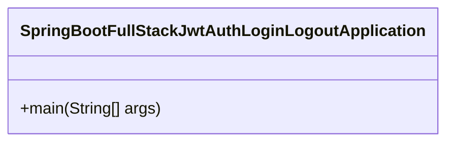
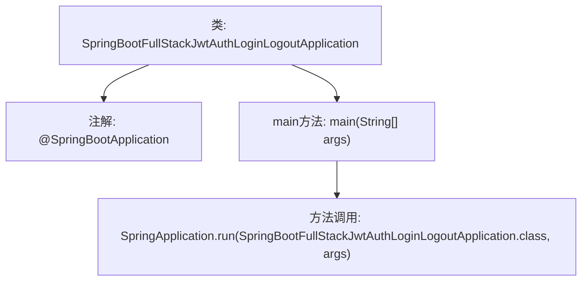

# 基础信息

|      |      |
|------|------|
| 名称 | SpringBootFullStackJwtAuthLoginLogoutApplication |
| 编码语言 | .java |
| 代码路径 | spring-boot-examples/spring-boot-react-examples/spring-boot-react-jwt-auth-login-logout/backend-spring-boot-react-jwt-auth-login-logout/src/main/java/com/in28minutes/fullstack/springboot/jwt/basic/authentication/springbootjwtauthloginlogout/SpringBootFullStackJwtAuthLoginLogoutApplication.java |
| 包名 | com.in28minutes.fullstack.springboot.jwt.basic.authentication.springbootjwtauthloginlogout |
| 依赖项 | ['org.springframework.boot.SpringApplication', 'org.springframework.boot.autoconfigure.SpringBootApplication'] |
| 概述说明 | Spring Boot应用支持JWT认证及登录注销功能。 |

# 说明

Spring Boot应用实现了JWT（JSON Web Token）认证机制，支持用户登录和注销功能。JWT认证通过生成和验证令牌来确保用户身份的安全性。登录功能允许用户通过验证后获取访问令牌，而注销功能则确保令牌失效，增强系统安全性。该应用通过集成JWT认证，提供了高效且安全的用户身份管理方案。

# 类列表 Class Summary

| 名称   | 类型  | 说明 |
|-------|------|-------------|
| SpringBootFullStackJwtAuthLoginLogoutApplication | class | Spring Boot应用，支持JWT认证及登录注销功能。 |

## 类 SpringBootFullStackJwtAuthLoginLogoutApplication

|      |      |
|------|------|
| 访问范围 | @SpringBootApplication;public |
| 类型 | class |
| 名称 | SpringBootFullStackJwtAuthLoginLogoutApplication |
| 说明 | Spring Boot应用，支持JWT认证及登录注销功能。 |

### UML类图

这段代码定义了一个Spring Boot应用程序的主类 `SpringBootFullStackJwtAuthLoginLogoutApplication`，其中包含一个 `main` 方法，用于启动Spring Boot应用程序。`@SpringBootApplication` 注解标记该类为Spring Boot应用的主类，`SpringApplication.run` 方法用于启动应用。该类的主要作用是作为应用的入口点，初始化并运行Spring Boot应用。

### 内部方法调用关系图

这段代码定义了一个Spring Boot应用程序的主类，使用了`@SpringBootApplication`注解来标记这是一个Spring Boot应用。`main`方法中调用了`SpringApplication.run`方法来启动该应用程序。流程图展示了类的结构以及`main`方法如何调用`SpringApplication.run`来启动应用。

### 字段列表 Field List

| 名称  | 类型  | 说明 |
|-------|-------|------|

### 方法列表 Method List

| 名称  | 类型  | 说明 |
|-------|-------|------|
| main | void | Java主方法启动Spring Boot应用，支持JWT认证的登录注销功能。 |

