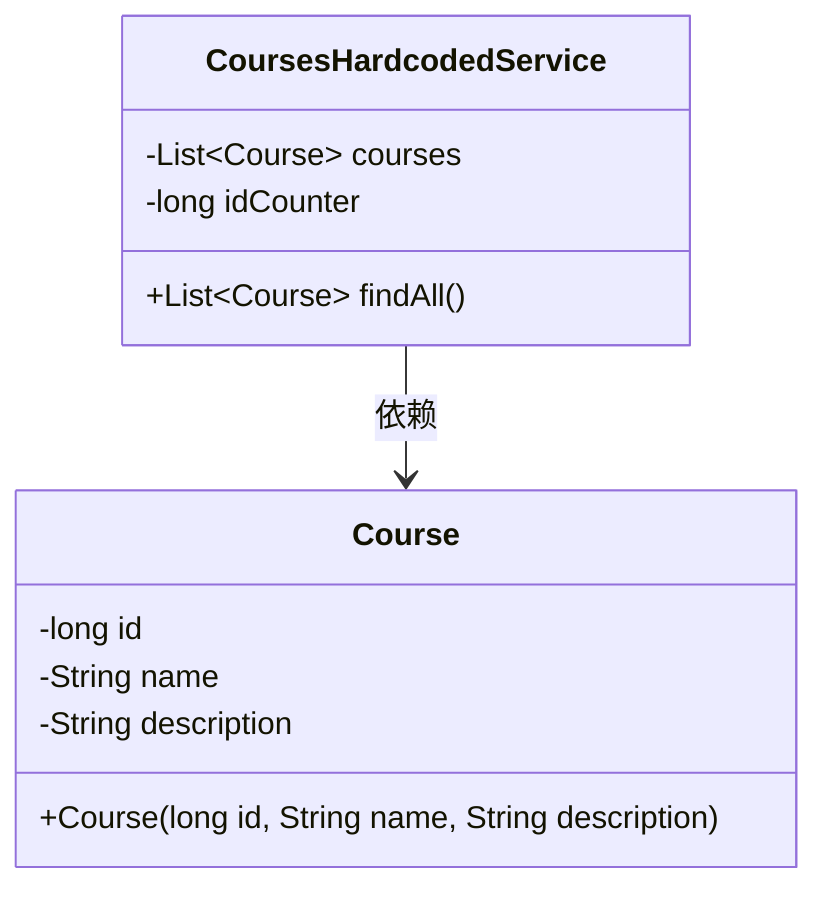
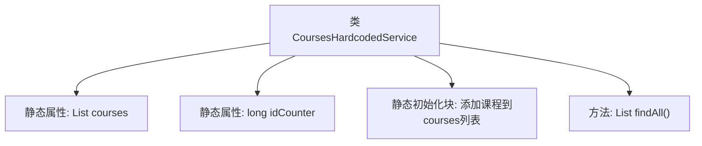

# 基础信息

|      |      |
|------|------|
| 名称 | CoursesHardcodedService |
| 编码语言 | .java |
| 代码路径 | spring-boot-examples/spring-boot-react-examples/spring-boot-react-jwt-auth-login-logout/backend-spring-boot-react-jwt-auth-login-logout/src/main/java/com/in28minutes/fullstack/springboot/jwt/basic/authentication/springbootjwtauthloginlogout/course/CoursesHardcodedService.java |
| 包名 | com.in28minutes.fullstack.springboot.jwt.basic.authentication.springbootjwtauthloginlogout.course |
| 依赖项 | ['java.util.ArrayList', 'java.util.List', 'org.springframework.stereotype.Service'] |
| 概述说明 | 课程服务类包含硬编码课程列表，支持查询所有课程功能。 |

# 说明

课程服务类中包含硬编码的课程列表，该列表用于存储所有课程信息。该服务类提供了一个功能，允许用户查询所有课程，以便获取完整的课程列表。通过这一功能，用户可以方便地检索和管理课程数据，确保系统能够高效地处理和展示课程信息。

# 类列表 Class Summary

| 名称   | 类型  | 说明 |
|-------|------|-------------|
| CoursesHardcodedService | class | 课程服务类硬编码课程列表，提供查询所有课程功能。 |

## 类 CoursesHardcodedService

|      |      |
|------|------|
| 访问范围 | @Service;public |
| 类型 | class |
| 名称 | CoursesHardcodedService |
| 说明 | 课程服务类硬编码课程列表，提供查询所有课程功能。 |

### UML类图

这段代码定义了一个 `CoursesHardcodedService` 类，用于管理一组硬编码的课程数据。`CoursesHardcodedService` 类包含一个静态的 `courses` 列表和一个静态的 `idCounter` 计数器。在静态初始化块中，课程列表被预填充了几个 `Course` 对象。`findAll` 方法返回所有课程的列表。`Course` 类表示单个课程，包含 `id`、`name` 和 `description` 属性，并通过构造函数进行初始化。`CoursesHardcodedService` 类依赖于 `Course` 类来管理课程数据。

### 内部方法调用关系图

这段代码定义了一个名为`CoursesHardcodedService`的类，其中包含两个静态属性：`courses`和`idCounter`。静态初始化块用于在类加载时向`courses`列表中添加四个预定义的课程对象。`findAll`方法返回`courses`列表，供外部调用。该代码主要用于管理和提供一组硬编码的课程数据。

### 字段列表 Field List

| 名称  | 类型  | 说明 |
|-------|-------|------|
| courses = new ArrayList<>() | List<Course> | 定义并初始化一个私有的静态课程列表。 |
| idCounter = 0 | long | 私有静态长整型变量idCounter初始化为0。 |

### 方法列表 Method List

| 名称  | 类型  | 说明 |
|-------|-------|------|
| findAll | List<Course> | 该方法返回所有课程列表。 |

