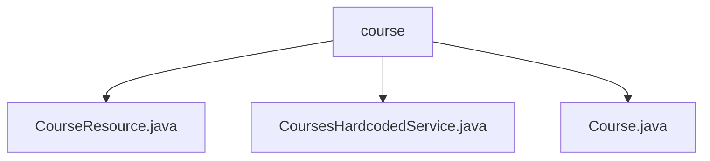

# 基础信息

|      |      |
|------|------|
| 名称 | course |
| 编码语言 | .java |
| 代码路径 | spring-boot-examples/spring-boot-react-examples/spring-boot-react-jwt-auth-login-logout/backend-spring-boot-react-jwt-auth-login-logout/src/main/java/com/in28minutes/fullstack/springboot/jwt/basic/authentication/springbootjwtauthloginlogout/course |
| 包名 | spring-boot-examples.spring-boot-react-examples.spring-boot-react-jwt-auth-login-logout.backend-spring-boot-react-jwt-auth-login-logout.src.main.java.com.in28minutes.fullstack.springboot.jwt.basic.authentication.springbootjwtauthloginlogout.course |
| 概述说明 | 跨域控制器允许3000和4200端口访问，支持按用户名获取课程列表。课程服务类提供硬编码课程列表查询功能。 |

# 说明

## 概述
该代码模块是一个基于Spring Boot和React的JWT认证登录注销系统的后端部分，主要功能包括跨域请求处理、课程信息管理和用户认证。模块通过跨域控制器配置允许本地3000和4200端口的访问请求，确保不同端口间的数据交互。同时，模块提供了课程管理功能，包括查询所有课程和根据用户名筛选课程列表，确保系统能够高效处理和展示课程信息。

## 主要业务场景
1. **跨域请求处理**：跨域控制器配置允许本地3000和4200端口的访问请求，确保前端应用能够与后端服务进行数据交互。
2. **课程信息管理**：
   - 课程服务类中维护了一个硬编码的课程列表，用户可以通过该服务类查询所有课程，获取完整的课程列表。
   - 支持根据用户名筛选相关课程信息，提升数据获取的精准性，确保用户能够方便地检索和管理与其相关的课程数据。
3. **用户认证**：通过JWT（JSON Web Token）实现用户认证，确保系统的安全性，并支持用户的登录和注销操作。

### 包内部结构视图

该流程图展示了`course`文件夹与其内部文件的层级关系。`course`作为根节点，包含三个子节点：`CourseResource.java`、`CoursesHardcodedService.java`和`Course.java`。这些文件都属于`course`文件夹，分别代表不同的功能模块或类，用于处理课程相关的资源、服务和课程实体。

# 文件列表 File List

| 名称   | 类型  | 说明 |
|-------|------|-------------|
| [CourseResource.java](CourseResource.md) | file | 跨域控制器允许3000和4200端口访问，获取用户课程列表。 |
| [Course.java](Course.md) | file | 信息为空，无法生成概要描述。 |
| [CoursesHardcodedService.java](CoursesHardcodedService.md) | file | 课程服务类包含硬编码课程列表，支持查询所有课程功能。 |

