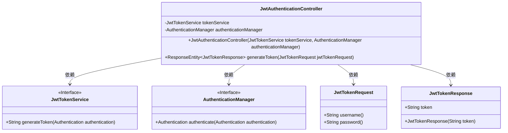
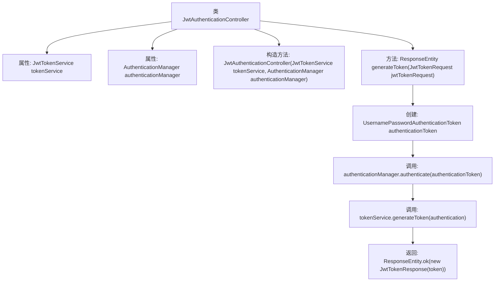

# 基础信息

|      |      |
|------|------|
| 名称 | JwtAuthenticationController |
| 编码语言 | .java |
| 代码路径 | spring-boot-examples/spring-boot-react-examples/spring-boot-react-jwt-auth-login-logout/backend-spring-boot-react-jwt-auth-login-logout/src/main/java/com/in28minutes/fullstack/springboot/jwt/basic/authentication/springbootjwtauthloginlogout/jwt/JwtAuthenticationController.java |
| 包名 | com.in28minutes.fullstack.springboot.jwt.basic.authentication.springbootjwtauthloginlogout.jwt |
| 依赖项 | ['org.springframework.http.ResponseEntity', 'org.springframework.security.authentication.AuthenticationManager', 'org.springframework.security.authentication.UsernamePasswordAuthenticationToken', 'org.springframework.web.bind.annotation.PostMapping', 'org.springframework.web.bind.annotation.RequestBody', 'org.springframework.web.bind.annotation.RestController'] |
| 概述说明 | JwtAuthenticationController生成JWT令牌。 |

# 说明

JwtAuthenticationController负责处理认证请求，利用认证管理器验证用户身份，并通过令牌服务生成JWT令牌。该控制器确保用户认证流程的安全性和有效性，生成的JWT令牌用于后续的授权和身份验证。

# 类列表 Class Summary

| 名称   | 类型  | 说明 |
|-------|------|-------------|
| JwtAuthenticationController | class | JwtAuthenticationController通过认证管理器和令牌服务生成JWT令牌。 |

## 类 JwtAuthenticationController

|      |      |
|------|------|
| 访问范围 | @RestController;public |
| 类型 | class |
| 名称 | JwtAuthenticationController |
| 说明 | JwtAuthenticationController通过认证管理器和令牌服务生成JWT令牌。 |

### UML类图

类图描述：  
`JwtAuthenticationController` 是一个控制器类，负责处理JWT认证请求。它依赖于 `JwtTokenService` 和 `AuthenticationManager` 两个接口，分别用于生成JWT令牌和管理认证。控制器通过 `generateToken` 方法接收 `JwtTokenRequest` 请求，生成并返回 `JwtTokenResponse` 响应。类图清晰地展示了这些类之间的依赖关系。

### 内部方法调用关系图

这段代码是一个Spring Boot控制器类，用于处理JWT（JSON Web Token）的生成和认证。控制器类`JwtAuthenticationController`包含两个属性：`JwtTokenService`和`AuthenticationManager`，分别用于生成JWT和进行用户认证。`generateToken`方法接收一个`JwtTokenRequest`对象，包含用户名和密码，创建一个`UsernamePasswordAuthenticationToken`对象，并通过`authenticationManager`进行认证。认证成功后，调用`tokenService`生成JWT，并返回包含该令牌的`ResponseEntity`对象。

### 字段列表 Field List

| 名称  | 类型  | 说明 |
|-------|-------|------|
| authenticationManager | AuthenticationManager | 私有且不可变的认证管理器实例。 |
| tokenService | JwtTokenService | 类中包含一个私有的JwtTokenService实例。 |

### 方法列表 Method List

| 名称  | 类型  | 说明 |
|-------|-------|------|
| generateToken | ResponseEntity<JwtTokenResponse> | 生成JWT令牌的API，验证用户名密码后返回令牌。 |

