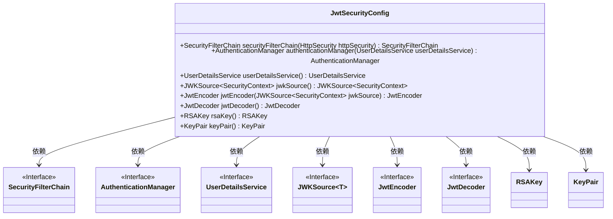
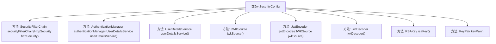

# 基础信息

|      |      |
|------|------|
| 名称 | JwtSecurityConfig |
| 编码语言 | .java |
| 代码路径 | spring-boot-examples/spring-boot-react-examples/spring-boot-react-jwt-auth-login-logout/backend-spring-boot-react-jwt-auth-login-logout/src/main/java/com/in28minutes/fullstack/springboot/jwt/basic/authentication/springbootjwtauthloginlogout/jwt/JwtSecurityConfig.java |
| 包名 | com.in28minutes.fullstack.springboot.jwt.basic.authentication.springbootjwtauthloginlogout.jwt |
| 依赖项 | ['java.security.KeyPair', 'java.security.KeyPairGenerator', 'java.security.interfaces.RSAPrivateKey', 'java.security.interfaces.RSAPublicKey', 'java.util.UUID', 'com.nimbusds.jose.JOSEException', 'com.nimbusds.jose.jwk.JWKSet', 'com.nimbusds.jose.jwk.RSAKey', 'com.nimbusds.jose.jwk.source.JWKSource', 'com.nimbusds.jose.proc.SecurityContext', 'org.springframework.boot.autoconfigure.security.servlet.PathRequest', 'org.springframework.context.annotation.Bean', 'org.springframework.context.annotation.Configuration', 'org.springframework.http.HttpMethod', 'org.springframework.security.authentication.AuthenticationManager', 'org.springframework.security.authentication.ProviderManager', 'org.springframework.security.authentication.dao.DaoAuthenticationProvider', 'org.springframework.security.config.Customizer', 'org.springframework.security.config.annotation.web.builders.HttpSecurity', 'org.springframework.security.config.annotation.web.configuration.EnableWebSecurity', 'org.springframework.security.config.annotation.web.configurers.AbstractHttpConfigurer', 'org.springframework.security.config.annotation.web.configurers.oauth2.server.resource.OAuth2ResourceServerConfigurer', 'org.springframework.security.config.http.SessionCreationPolicy', 'org.springframework.security.core.userdetails.User', 'org.springframework.security.core.userdetails.UserDetails', 'org.springframework.security.core.userdetails.UserDetailsService', 'org.springframework.security.oauth2.jwt.JwtDecoder', 'org.springframework.security.oauth2.jwt.JwtEncoder', 'org.springframework.security.oauth2.jwt.NimbusJwtDecoder', 'org.springframework.security.oauth2.jwt.NimbusJwtEncoder', 'org.springframework.security.provisioning.InMemoryUserDetailsManager', 'org.springframework.security.web.SecurityFilterChain'] |
| 概述说明 | 配置Spring Security支持JWT认证，禁用CSRF，无状态会话，允许H2控制台访问。 |

# 说明

配置Spring Security以支持JWT认证，通过禁用CSRF保护来简化安全性设置，同时设置无状态会话以提升系统性能。此外，允许H2控制台访问以便于开发和调试。这些配置确保了系统的安全性、灵活性和开发便利性。

# 类列表 Class Summary

| 名称   | 类型  | 说明 |
|-------|------|-------------|
| JwtSecurityConfig | class | 配置Spring Security，支持JWT认证，禁用CSRF，设置无状态会话，允许H2控制台访问。 |

## 类 JwtSecurityConfig

|      |      |
|------|------|
| 访问范围 | @Configuration;@EnableWebSecurity;public |
| 类型 | class |
| 名称 | JwtSecurityConfig |
| 说明 | 配置Spring Security，支持JWT认证，禁用CSRF，设置无状态会话，允许H2控制台访问。 |

### UML类图

该代码定义了一个名为 `JwtSecurityConfig` 的配置类，用于配置 Spring Security 的 JWT 认证机制。该类通过多个 `@Bean` 方法创建了各种安全相关的组件，如 `SecurityFilterChain`、`AuthenticationManager`、`UserDetailsService` 等。这些组件共同协作，实现了基于 JWT 的认证和授权机制。类图中的依赖关系展示了 `JwtSecurityConfig` 类如何依赖于这些接口和类来构建安全配置。

### 内部方法调用关系图

这段代码是一个Spring Security配置类，用于配置JWT（JSON Web Token）的安全性。它定义了多个Bean，包括安全过滤器链、认证管理器、用户详情服务、JWT编码器和解码器等。通过这些配置，代码实现了对HTTP请求的授权、CSRF保护、会话管理、OAuth2资源服务器配置等功能。每个Bean都有特定的职责，共同构成了一个完整的JWT安全配置体系。

### 字段列表 Field List

| 名称  | 类型  | 说明 |
|-------|-------|------|

### 方法列表 Method List

| 名称  | 类型  | 说明 |
|-------|-------|------|
| jwtDecoder | JwtDecoder | 定义JwtDecoder Bean，使用NimbusJwtDecoder和RSA公钥构建。 |
| keyPair | KeyPair | 生成2048位RSA密钥对的Java方法。 |
| rsaKey | RSAKey | 创建RSA密钥对并生成唯一标识的RSAKey对象。 |
| authenticationManager | AuthenticationManager | 该方法创建并配置认证管理器，使用DaoAuthenticationProvider和UserDetailsService进行用户认证。 |
| securityFilterChain | SecurityFilterChain | 配置Spring Security过滤器链，允许匿名访问特定路径，禁用CSRF，使用无状态会话和JWT认证。 |
| jwkSource | JWKSource<SecurityContext> | 生成JWKSource方法，使用RSA密钥创建JWKSet并返回选择器结果。 |
| jwtEncoder | JwtEncoder | 创建JwtEncoder实例，使用NimbusJwtEncoder和JWKSource。 |
| userDetailsService | UserDetailsService | 定义用户服务，创建用户in28minutes，密码dummy，权限read，角色USER，内存管理。 |

