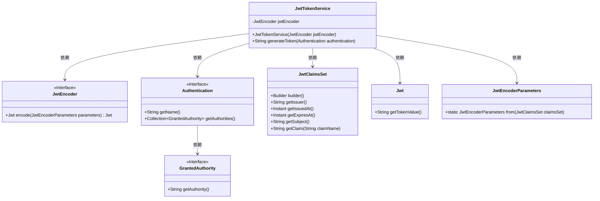
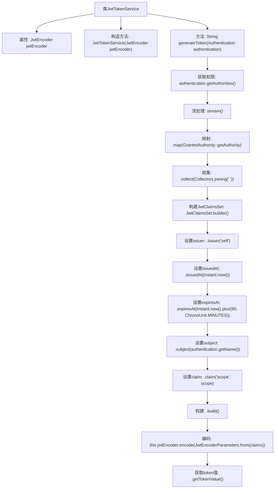

# 基础信息

|      |      |
|------|------|
| 名称 | JwtTokenService |
| 编码语言 | .java |
| 代码路径 | spring-boot-examples/spring-boot-react-examples/spring-boot-react-jwt-auth-login-logout/backend-spring-boot-react-jwt-auth-login-logout/src/main/java/com/in28minutes/fullstack/springboot/jwt/basic/authentication/springbootjwtauthloginlogout/jwt/JwtTokenService.java |
| 包名 | com.in28minutes.fullstack.springboot.jwt.basic.authentication.springbootjwtauthloginlogout.jwt |
| 依赖项 | ['java.time.Instant', 'java.time.temporal.ChronoUnit', 'java.util.stream.Collectors', 'org.springframework.security.core.Authentication', 'org.springframework.security.core.GrantedAuthority', 'org.springframework.security.oauth2.jwt.JwtClaimsSet', 'org.springframework.security.oauth2.jwt.JwtEncoder', 'org.springframework.security.oauth2.jwt.JwtEncoderParameters', 'org.springframework.stereotype.Service'] |
| 概述说明 | JwtTokenService类通过JwtEncoder生成带用户权限和有效期的JWT令牌。 |

# 说明

JwtTokenService类通过JwtEncoder生成JWT令牌，该令牌包含用户的权限信息和有效期。这一过程确保了令牌的安全性和有效性，能够准确反映用户的权限状态和令牌的使用期限。

# 类列表 Class Summary

| 名称   | 类型  | 说明 |
|-------|------|-------------|
| JwtTokenService | class | JwtTokenService类使用JwtEncoder生成包含用户权限和有效期的JWT令牌。 |

## 类 JwtTokenService

|      |      |
|------|------|
| 访问范围 | @Service;public |
| 类型 | class |
| 名称 | JwtTokenService |
| 说明 | JwtTokenService类使用JwtEncoder生成包含用户权限和有效期的JWT令牌。 |

### UML类图

这段代码定义了一个`JwtTokenService`类，用于生成JWT令牌。`JwtTokenService`依赖于`JwtEncoder`接口来编码JWT令牌，并依赖于`Authentication`接口来获取用户信息和权限。`Authentication`接口进一步依赖于`GrantedAuthority`接口来获取权限信息。`JwtClaimsSet`类用于构建JWT的声明集，`Jwt`类表示生成的JWT令牌，`JwtEncoderParameters`类用于封装JWT编码参数。整个过程通过调用`generateToken`方法生成并返回JWT令牌。

### 内部方法调用关系图

这段代码定义了一个`JwtTokenService`类，用于生成JWT令牌。通过`generateToken`方法，首先从`Authentication`对象中获取权限并拼接成字符串，然后构建`JwtClaimsSet`对象，设置令牌的签发者、签发时间、过期时间、主题和权限范围。最后使用`jwtEncoder`对`JwtClaimsSet`进行编码，并返回生成的令牌值。流程图清晰地展示了这一过程的各个步骤及其调用关系。

### 字段列表 Field List

| 名称  | 类型  | 说明 |
|-------|-------|------|
| jwtEncoder | JwtEncoder | 类中包含一个私有的JwtEncoder实例。 |

### 方法列表 Method List

| 名称  | 类型  | 说明 |
|-------|-------|------|
| generateToken | String | 生成包含用户权限和过期时间的JWT令牌。 |

