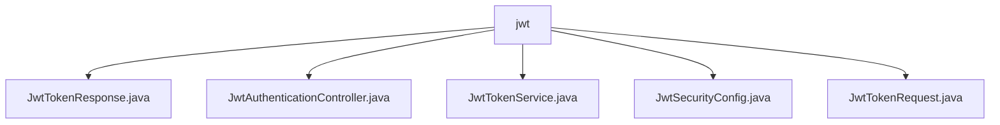

# 基础信息

|      |      |
|------|------|
| 名称 | jwt |
| 编码语言 | .java |
| 代码路径 | spring-boot-examples/spring-boot-react-examples/spring-boot-react-jwt-auth-login-logout/backend-spring-boot-react-jwt-auth-login-logout/src/main/java/com/in28minutes/fullstack/springboot/jwt/basic/authentication/springbootjwtauthloginlogout/jwt |
| 包名 | spring-boot-examples.spring-boot-react-examples.spring-boot-react-jwt-auth-login-logout.backend-spring-boot-react-jwt-auth-login-logout.src.main.java.com.in28minutes.fullstack.springboot.jwt.basic.authentication.springbootjwtauthloginlogout.jwt |
| 概述说明 | Jwt认证控制器处理请求，生成JWT令牌，确保安全有效。 |

# 说明

## 概述
该代码模块是一个基于Spring Boot和React的JWT认证系统，主要用于处理用户登录、注销以及JWT令牌的生成和验证。模块通过Spring Security配置来确保系统的安全性，同时提供了便捷的开发调试功能。主要组件包括JwtAuthenticationController、JwtTokenService和JwtSecurityConfig，分别负责处理认证请求、生成JWT令牌以及配置Spring Security。

## 主要业务场景
1. **用户认证**：JwtAuthenticationController处理用户的登录请求，利用认证管理器验证用户身份，并通过JwtTokenService生成JWT令牌。生成的令牌包含用户的权限信息和有效期，用于后续的授权和身份验证。
2. **JWT令牌生成**：JwtTokenService类通过JwtEncoder生成JWT令牌，确保令牌的安全性和有效性，能够准确反映用户的权限状态和令牌的使用期限。
3. **安全配置**：JwtSecurityConfig配置Spring Security以支持JWT认证，通过禁用CSRF保护来简化安全性设置，同时设置无状态会话以提升系统性能。此外，允许H2控制台访问以便于开发和调试。
4. **用户注销**：模块支持用户注销功能，确保用户退出系统后，其JWT令牌失效，防止未授权访问。

### 包内部结构视图

该流程图展示了`jwt`文件夹与其内部文件的层级关系。`jwt`作为根节点，包含了五个文件，分别是`JwtTokenResponse.java`、`JwtAuthenticationController.java`、`JwtTokenService.java`、`JwtSecurityConfig.java`和`JwtTokenRequest.java`。这些文件都直接隶属于`jwt`文件夹，没有进一步的子文件夹结构。

# 文件列表 File List

| 名称   | 类型  | 说明 |
|-------|------|-------------|
| [JwtTokenRequest.java](JwtTokenRequest.md) | file | 内容为空，无法生成概要描述。 |
| [JwtTokenService.java](JwtTokenService.md) | file | JwtTokenService类通过JwtEncoder生成带用户权限和有效期的JWT令牌。 |
| [JwtSecurityConfig.java](JwtSecurityConfig.md) | file | 配置Spring Security支持JWT认证，禁用CSRF，无状态会话，允许H2控制台访问。 |
| [JwtAuthenticationController.java](JwtAuthenticationController.md) | file | JwtAuthenticationController生成JWT令牌。 |
| [JwtTokenResponse.java](JwtTokenResponse.md) | file | 提供内容以生成简洁明了的总结说明。 |

