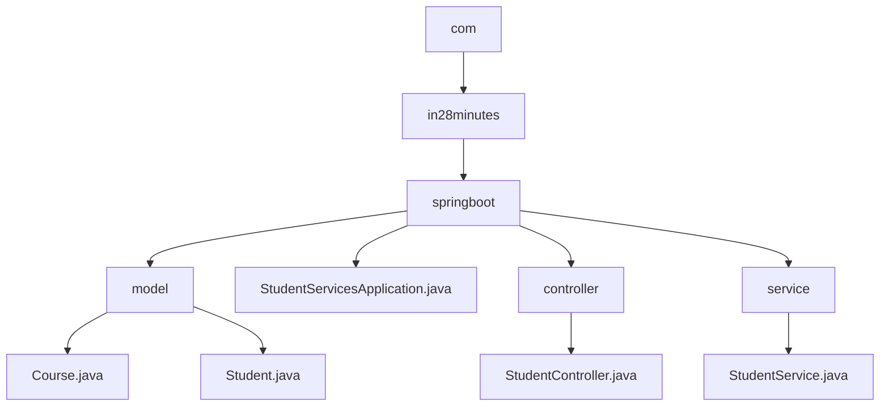

# 基础信息

|      |      |
|------|------|
| 名称 | com |
| 编码语言 | .java |
| 代码路径 | spring-boot-examples/spring-boot-rest-services-with-unit-and-integration-tests/src/main/java/com |
| 包名 | spring-boot-examples.spring-boot-rest-services-with-unit-and-integration-tests.src.main.java.com |
| 概述说明 | Spring Boot REST服务示例，包含学生和课程管理，支持增删改查操作，并通过单元和集成测试确保服务正确性。 |

# 说明

## 概述
该代码模块是一个基于Spring Boot的REST服务示例，展示了如何构建和管理学生（Student）和课程（Course）两个实体类的RESTful服务。模块不仅实现了基本的增删改查操作，还通过单元测试和集成测试确保服务的正确性和可靠性。模块的核心功能包括学生管理、课程管理以及测试覆盖，适用于需要构建RESTful服务并进行全面测试的Spring Boot应用开发场景。

## 主要业务场景
1. **学生管理**：通过`Student.java`类，模块实现了学生的基本属性定义和管理，包括学生的姓名、ID、课程等信息。该场景涉及学生的增删改查操作，并通过REST API对外提供服务。
2. **课程管理**：通过`Course.java`类，模块定义了课程的基本属性，如课程名称、ID、描述等。该场景涉及课程的增删改查操作，并通过REST API对外提供服务。
3. **测试覆盖**：模块通过单元测试和集成测试，确保学生和课程管理的业务逻辑正确性，验证REST API的响应和行为符合预期。测试场景包括正常操作、异常处理、数据验证等。
4. **应用启动与管理**：通过`StudentServicesApplication.java`类，模块负责初始化并运行学生服务应用，确保应用能够顺利启动并提供所需的服务。该类包含必要的配置和依赖管理，确保应用在启动时能够正确加载和配置相关组件。
5. **学生课程管理**：通过学生控制器类，模块处理与学生课程相关的操作，包括查询可用课程信息、注册新课程以及管理已注册课程的状态。该控制器类通过提供清晰的接口和功能，简化学生与课程管理系统的交互，提升用户体验和操作效率。
6. **数据管理**：通过`StudentService`类，模块集中处理学生与课程的关联数据，主要功能包括查询学生信息和课程信息，以及添加新的课程，确保数据的有效管理和操作便捷性。

### 包内部结构视图

该流程图展示了Spring Boot项目中Java包的层级结构。从根目录`com`开始，逐级展开到`in28minutes`、`springboot`，并进一步细分为`model`、`controller`和`service`等子包。每个子包下包含相应的Java类文件，如`Course.java`、`Student.java`、`StudentController.java`和`StudentService.java`等，清晰地展示了项目的组织结构。

# 文件列表 File List

| 名称   | 类型  | 说明 |
|-------|------|-------------|
| [in28minutes](in28minutes/_module.md) | package | Spring Boot REST服务示例，包含学生和课程管理，支持增删改查操作，并通过单元和集成测试确保服务正确性。 |

