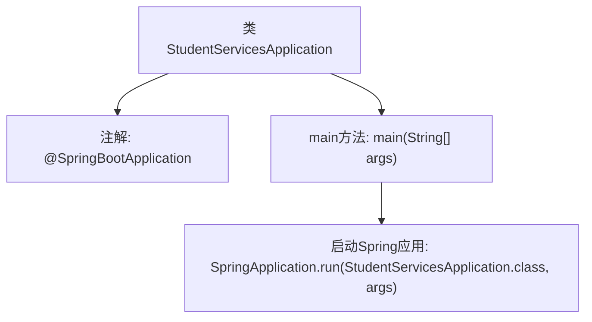

# 基础信息

|      |      |
|------|------|
| 名称 | StudentServicesApplication |
| 编码语言 | .java |
| 代码路径 | spring-boot-examples/spring-boot-rest-services-with-unit-and-integration-tests/src/main/java/com/in28minutes/springboot/StudentServicesApplication.java |
| 包名 | com.in28minutes.springboot |
| 依赖项 | ['org.springframework.boot.SpringApplication', 'org.springframework.boot.autoconfigure.SpringBootApplication'] |
| 概述说明 | Spring Boot应用类，用于启动学生服务。 |

# 说明

Spring Boot应用类是一个用于启动学生服务应用的核心类。它负责初始化并运行学生服务相关的功能模块，确保应用能够顺利启动并提供所需的服务。该类通常包含必要的配置和依赖管理，以便应用在启动时能够正确加载和配置相关组件。通过这个类，开发者可以方便地管理和部署学生服务应用，确保其高效稳定地运行。

# 类列表 Class Summary

| 名称   | 类型  | 说明 |
|-------|------|-------------|
| StudentServicesApplication | class | Spring Boot应用类，用于启动学生服务应用。 |


## 类 StudentServicesApplication

|      |      |
|------|------|
| 访问范围 | @SpringBootApplication;public |
| 类型 | class |
| 名称 | StudentServicesApplication |
| 说明 | Spring Boot应用类，用于启动学生服务应用。 |


### UML类图

```mermaid
classDiagram
    class StudentServicesApplication {
        +static void main(String[] args)
    }
    // StudentServicesApplication 依赖于 SpringApplication 来启动应用
    StudentServicesApplication --> SpringApplication : 依赖
```

**描述：**
`StudentServicesApplication` 是一个 Spring Boot 应用的启动类，通过 `main` 方法启动应用。该类依赖于 `SpringApplication` 类的 `run` 方法来初始化并运行 Spring Boot 应用。此代码是 Spring Boot 应用的入口点，负责启动整个应用程序。


### 内部方法调用关系图



这段代码是一个简单的Spring Boot应用程序的启动类。`StudentServicesApplication`类使用了`@SpringBootApplication`注解，表明这是一个Spring Boot应用的主类。`main`方法是程序的入口，它通过调用`SpringApplication.run`方法来启动Spring应用，并传递`StudentServicesApplication.class`和命令行参数`args`作为参数。这个流程展示了Spring Boot应用的启动过程，从类定义到应用启动的完整步骤。

### 字段列表 Field List

| 名称  | 类型  | 说明 |
|-------|-------|------|

### 方法列表 Method List

| 名称  | 类型  | 说明 |
|-------|-------|------|
| main | void | Spring Boot启动类，运行StudentServicesApplication。 |


