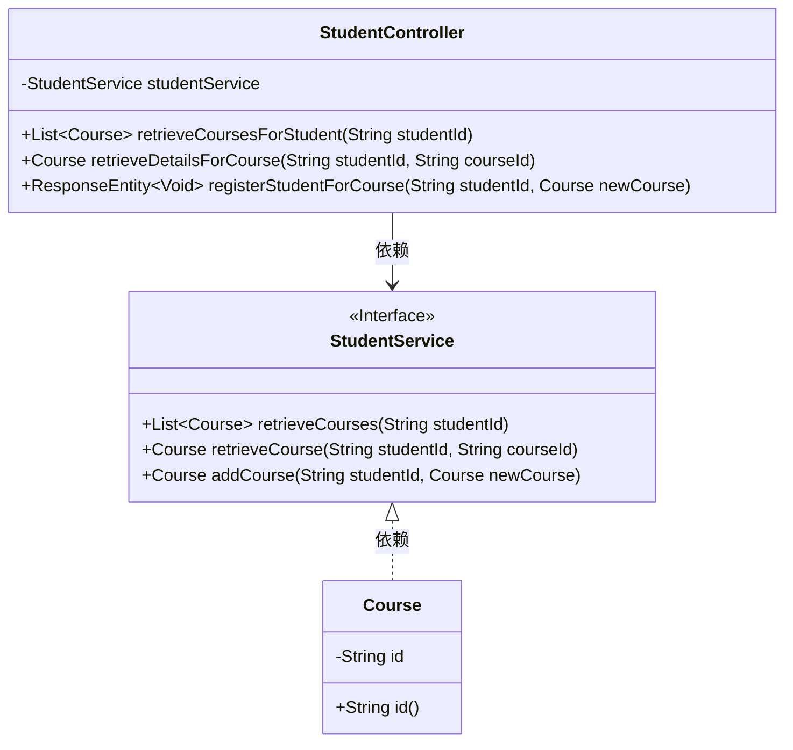
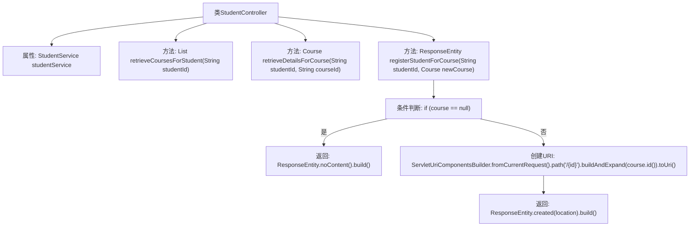

# 基础信息

|      |      |
|------|------|
| 名称 | StudentController |
| 编码语言 | .java |
| 代码路径 | spring-boot-examples/spring-boot-rest-services-with-unit-and-integration-tests/src/main/java/com/in28minutes/springboot/controller/StudentController.java |
| 包名 | com.in28minutes.springboot.controller |
| 依赖项 | ['java.net.URI', 'java.util.List', 'com.in28minutes.springboot.model.Course', 'com.in28minutes.springboot.service.StudentService', 'org.springframework.beans.factory.annotation.Autowired', 'org.springframework.http.ResponseEntity', 'org.springframework.web.bind.annotation.GetMapping', 'org.springframework.web.bind.annotation.PathVariable', 'org.springframework.web.bind.annotation.PostMapping', 'org.springframework.web.bind.annotation.RequestBody', 'org.springframework.web.bind.annotation.RequestMapping', 'org.springframework.web.bind.annotation.RestController', 'org.springframework.web.servlet.support.ServletUriComponentsBuilder'] |
| 概述说明 | 学生控制器类负责课程查询与注册管理。 |

# 说明

学生控制器类是一个用于管理学生课程查询和注册的模块。它负责处理与学生课程相关的操作，包括查询可用课程信息、注册新课程以及管理已注册课程的状态。该控制器类通过提供清晰的接口和功能，确保学生能够方便地查看课程详情、进行课程注册，并实时更新个人课程信息。其设计旨在简化学生与课程管理系统的交互，提升用户体验和操作效率。

# 类列表 Class Summary

| 名称   | 类型  | 说明 |
|-------|------|-------------|
| StudentController | class | 学生控制器类，管理学生课程查询和注册。 |

## 类 StudentController

|      |      |
|------|------|
| 访问范围 | @RestController;@RequestMapping("/students/{studentId}/courses");public |
| 类型 | class |
| 名称 | StudentController |
| 说明 | 学生控制器类，管理学生课程查询和注册。 |

### UML类图

这段代码展示了一个Spring Boot控制器 `StudentController`，它处理与学生课程相关的HTTP请求。`StudentController` 依赖于 `StudentService` 接口来获取课程信息、课程详情以及注册新课程。`StudentService` 接口定义了三个方法：`retrieveCourses`、`retrieveCourse` 和 `addCourse`，分别用于获取学生课程列表、获取特定课程详情以及注册新课程。`Course` 类表示课程对象，包含课程ID。控制器通过 `@Autowired` 注入 `StudentService` 实例，并使用 `@GetMapping` 和 `@PostMapping` 注解处理不同的HTTP请求。

### 内部方法调用关系图

这段代码定义了一个名为`StudentController`的Spring Boot控制器类，用于处理与学生课程相关的HTTP请求。它包含三个主要方法：`retrieveCoursesForStudent`用于获取指定学生的所有课程，`retrieveDetailsForCourse`用于获取指定学生特定课程的详细信息，`registerStudentForCourse`用于为学生注册新课程。`registerStudentForCourse`方法在成功注册课程后返回一个包含新课程URI的响应，如果注册失败则返回空内容响应。

### 字段列表 Field List

| 名称  | 类型  | 说明 |
|-------|-------|------|
| studentService | StudentService | 使用@Autowired自动注入StudentService实例。 |

### 方法列表 Method List

| 名称  | 类型  | 说明 |
|-------|-------|------|
| retrieveCoursesForStudent | List<Course> | 通过学生ID获取课程列表的方法。 |
| registerStudentForCourse | ResponseEntity<Void> | 通过学生ID注册课程，返回新课程URI或空响应。 |
| retrieveDetailsForCourse | Course | 通过学生ID和课程ID获取课程详细信息。 |

