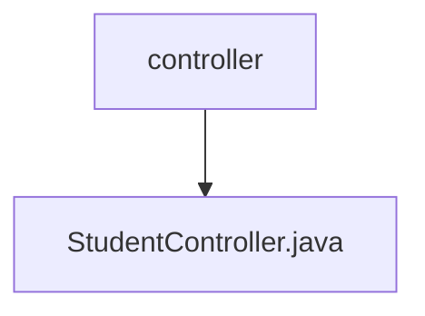

# 基础信息

|      |      |
|------|------|
| 名称 | controller |
| 编码语言 | .java |
| 代码路径 | spring-boot-examples/spring-boot-rest-services-with-unit-and-integration-tests/src/main/java/com/in28minutes/springboot/controller |
| 包名 | spring-boot-examples.spring-boot-rest-services-with-unit-and-integration-tests.src.main.java.com.in28minutes.springboot.controller |
| 概述说明 | 学生控制器类负责课程查询与注册管理。 |

# 说明

学生控制器类是一个用于管理学生课程查询和注册的模块。它负责处理与学生课程相关的操作，包括查询可用课程信息、注册新课程以及管理已注册课程的状态。该控制器类通过提供清晰的接口和功能，确保学生能够方便地查看课程详情、进行课程注册，并实时更新个人课程信息。其设计旨在简化学生与课程管理系统的交互，提升用户体验和操作效率。

### 包内部结构视图

该流程图展示了路径的层级关系，其中`controller`文件夹包含一个文件`StudentController.java`。整个结构简洁明了，清晰地反映了路径的组织方式。

# 文件列表 File List

| 名称   | 类型  | 说明 |
|-------|------|-------------|
| [StudentController.java](StudentController.md) | file | 学生控制器类负责课程查询与注册管理。 |

