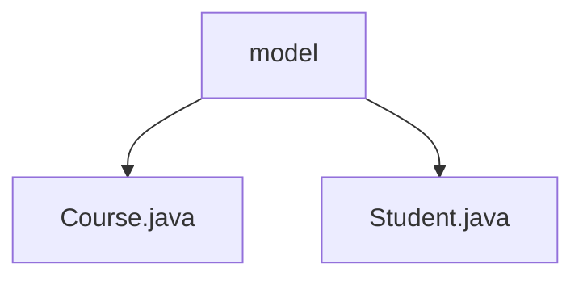

# 基础信息

|      |      |
|------|------|
| 名称 | model |
| 编码语言 | .java |
| 代码路径 | spring-boot-examples/spring-boot-rest-services-with-unit-and-integration-tests/src/main/java/com/in28minutes/springboot/model |
| 包名 | spring-boot-examples.spring-boot-rest-services-with-unit-and-integration-tests.src.main.java.com.in28minutes.springboot.model |
| 概述说明 | 无法生成总结，内容为空。 |

# 说明

## 概述
该代码模块是一个基于Spring Boot的REST服务示例，包含了单元测试和集成测试的实现。模块主要涉及学生（Student）和课程（Course）两个实体类的建模，展示了如何在Spring Boot应用中构建RESTful服务，并通过单元测试和集成测试确保服务的正确性和可靠性。

## 主要业务场景
1. **学生管理**：通过`Student.java`类，模块实现了学生的基本属性定义和管理，可能包括学生的姓名、ID、课程等信息。该场景涉及学生的增删改查操作，并通过REST API对外提供服务。
2. **课程管理**：通过`Course.java`类，模块定义了课程的基本属性，如课程名称、ID、描述等。该场景涉及课程的增删改查操作，并通过REST API对外提供服务。
3. **测试覆盖**：模块通过单元测试和集成测试，确保学生和课程管理的业务逻辑正确性，验证REST API的响应和行为符合预期。测试场景包括正常操作、异常处理、数据验证等。

该模块适用于需要构建RESTful服务并进行全面测试的Spring Boot应用开发场景。

### 包内部结构视图

该流程图展示了Spring Boot项目中`model`目录下的文件层级关系。`model`作为根节点，包含了两个子节点：`Course.java`和`Student.java`。这些文件是Spring Boot应用程序中用于定义数据模型的Java类，分别表示课程和学生实体。

# 文件列表 File List

| 名称   | 类型  | 说明 |
|-------|------|-------------|
| [Student.java](Student.md) | file | 信息为空，无法生成概要描述。 |
| [Course.java](Course.md) | file | 信息为空，无法生成概要描述。 |

