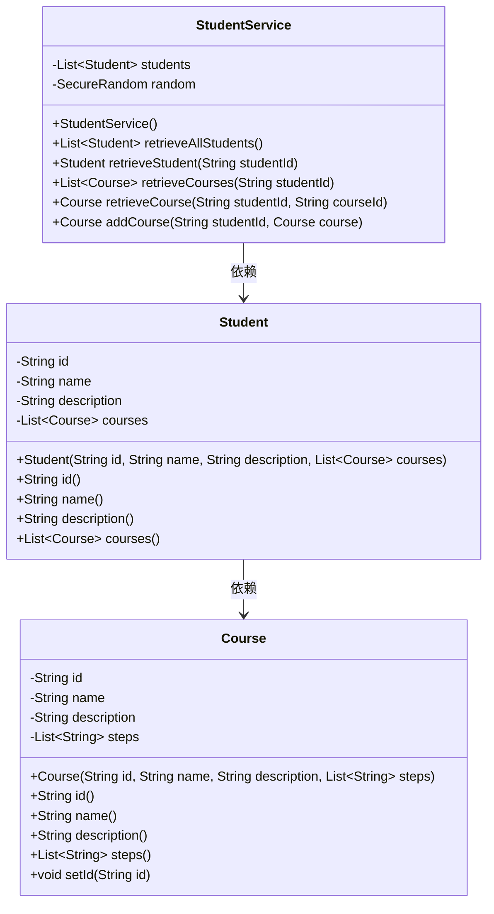
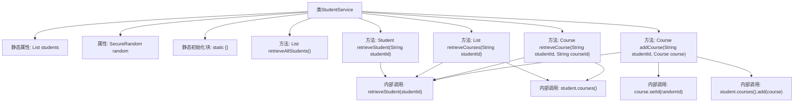

# 基础信息

|      |      |
|------|------|
| 名称 | StudentService |
| 编码语言 | .java |
| 代码路径 | spring-boot-examples/spring-boot-rest-services-with-unit-and-integration-tests/src/main/java/com/in28minutes/springboot/service/StudentService.java |
| 包名 | com.in28minutes.springboot.service |
| 依赖项 | ['java.math.BigInteger', 'java.security.SecureRandom', 'java.util.ArrayList', 'java.util.List', 'com.in28minutes.springboot.model.Course', 'com.in28minutes.springboot.model.Student', 'org.springframework.stereotype.Service'] |
| 概述说明 | StudentService类负责管理学生和课程数据，支持查询和添加课程功能。 |

# 说明

StudentService类负责管理学生和课程的相关数据，主要功能包括查询学生信息和课程信息，以及添加新的课程。该类通过集中处理学生与课程的关联数据，确保数据的有效管理和操作便捷性。

# 类列表 Class Summary

| 名称   | 类型  | 说明 |
|-------|------|-------------|
| StudentService | class | StudentService类管理学生和课程数据，提供查询、添加课程功能。 |

## 类 StudentService

|      |      |
|------|------|
| 访问范围 | @Service;public |
| 类型 | class |
| 名称 | StudentService |
| 说明 | StudentService类管理学生和课程数据，提供查询、添加课程功能。 |

### UML类图

**描述：**  
`StudentService` 类负责管理学生及其课程信息。它包含一个静态的学生列表 `students`，并通过 `SecureRandom` 生成随机ID。类中提供了多个方法，如 `retrieveAllStudents` 用于获取所有学生，`retrieveStudent` 用于根据ID获取特定学生，`retrieveCourses` 用于获取学生的课程列表，`retrieveCourse` 用于获取特定课程，以及 `addCourse` 用于为学生添加新课程。`Student` 类表示学生，包含ID、姓名、描述和课程列表。`Course` 类表示课程，包含ID、名称、描述和步骤列表。

### 内部方法调用关系图

该流程图描述了`StudentService`类的结构和内部方法调用关系。`StudentService`类包含一个静态初始化块用于初始化学生数据，以及多个方法用于检索学生信息、课程信息以及添加课程。方法之间的调用关系通过箭头表示，如`retrieveStudent`方法被多个其他方法调用，`addCourse`方法内部调用了`retrieveStudent`和`course.setId`等方法。

### 字段列表 Field List

| 名称  | 类型  | 说明 |
|-------|-------|------|
| students = new ArrayList<>() | List<Student> | 定义了一个私有的静态不可变学生列表。 |
| random = new SecureRandom() | SecureRandom | 使用SecureRandom生成安全的随机数。 |

### 方法列表 Method List

| 名称  | 类型  | 说明 |
|-------|-------|------|
| retrieveAllStudents | List<Student> | 方法retrieveAllStudents返回所有学生列表。 |
| retrieveCourses | List<Course> | 根据学生ID检索课程列表，若学生不存在则返回空。 |
| addCourse | Course | 该方法为指定学生添加课程，生成随机ID并返回课程对象。 |
| retrieveCourse | Course | 通过学生ID和课程ID查找并返回对应课程，若学生或课程不存在则返回null。 |
| retrieveStudent | Student | 通过学生ID从列表中查找并返回对应学生对象，若未找到则返回null。 |

