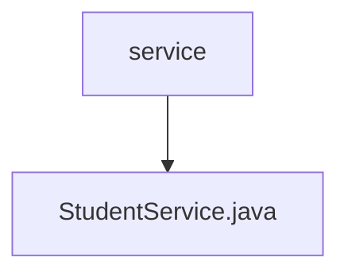

# 基础信息

|      |      |
|------|------|
| 名称 | service |
| 编码语言 | .java |
| 代码路径 | spring-boot-examples/spring-boot-rest-services-with-unit-and-integration-tests/src/main/java/com/in28minutes/springboot/service |
| 包名 | spring-boot-examples.spring-boot-rest-services-with-unit-and-integration-tests.src.main.java.com.in28minutes.springboot.service |
| 概述说明 | StudentService类负责管理学生和课程数据，支持查询和添加课程功能。 |

# 说明

StudentService类负责管理学生和课程的相关数据，主要功能包括查询学生信息和课程信息，以及添加新的课程。该类通过集中处理学生与课程的关联数据，确保数据的有效管理和操作便捷性。

### 包内部结构视图

该流程图展示了`service`文件夹与`StudentService.java`文件之间的层级关系。`service`是父节点，`StudentService.java`是其子节点，表示该文件位于`service`文件夹内。这种结构清晰地反映了文件在项目中的位置和层级关系。

# 文件列表 File List

| 名称   | 类型  | 说明 |
|-------|------|-------------|
| [StudentService.java](StudentService.md) | file | StudentService类负责管理学生和课程数据，支持查询和添加课程功能。 |

