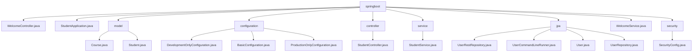

# 基础信息

|      |      |
|------|------|
| 名称 | com |
| 编码语言 | .java |
| 代码路径 | spring-boot-examples/spring-boot-rest-services/src/main/java/com |
| 包名 | spring-boot-examples.spring-boot-rest-services.src.main.java.com |
| 概述说明 | Spring Boot项目包含欢迎控制器、学生管理、课程管理、配置管理、安全控制等核心功能模块。 |

# 说明

## 概述
该代码模块是一个基于Spring Boot的REST服务示例项目，主要用于管理和操作用户、学生、课程等相关数据。模块中包含多个类，分别负责数据的初始化、存储、检索以及业务逻辑的处理。通过这些类的协作，应用程序能够有效地管理用户信息、学生信息、课程信息，并提供RESTful API接口支持前后端分离的Web应用开发。此外，模块还集成了动态配置、安全管理等功能，确保系统的灵活性和安全性。

## 主要业务场景
1. **用户管理**：通过`User`类定义用户的基本信息，如ID、姓名和角色，并通过`UserCommandLineRunner`类在应用启动时初始化用户数据。`UserRepository`类负责与数据库进行交互，提供对用户数据的增删改查操作。`UserRestRepository`类提供RESTful API接口，支持外部系统通过HTTP请求与用户数据进行交互。

2. **学生管理**：通过`Student`类定义学生的基本信息，如学生ID、姓名、年龄等，并通过`StudentService`类提供查询和添加学生及课程的功能。`StudentController`类负责处理与学生课程相关的各类请求，如获取学生课程列表、处理学生注册课程的请求以及查询特定课程的详细信息。

3. **课程管理**：通过`Course`类定义课程的基本属性，如课程ID、名称、描述等，支持对课程信息的增删改查操作。`StudentService`类还具备处理异常的能力，确保在操作过程中能够有效应对可能出现的错误或异常情况，从而保证系统的稳定性和数据的完整性。

4. **欢迎信息管理**：通过`WelcomeController`类展示欢迎信息，并支持通过动态配置接口灵活调整这些信息的内容或展示方式。`WelcomeService`类通过`@Value`注解注入欢迎信息，并提供了`retrieveWelcomeMessage`方法，用于返回该欢迎信息。

5. **配置管理**：模块中包含多个配置类，分别针对开发环境、生产环境以及基本配置进行定制。开发环境配置类专注于返回特定的字符串数据，生产环境配置类则确保在生产环境中返回固定的字符串值，而基本配置类则提供了对布尔值、字符串和整数属性的管理和操作功能。

6. **安全管理**：通过Spring Security配置类，禁用CSRF保护，设置角色访问控制，使用HTTP Basic认证，并管理会话状态，确保应用程序的安全性和用户访问控制的有效性。

该模块适用于教育管理系统、在线学习平台等场景，能够有效管理用户、学生和课程信息，并通过REST API提供服务接口，确保系统的灵活性、安全性和可维护性。

### 包内部结构视图

该流程图展示了Spring Boot项目中`springboot`目录下的文件及子目录的层级关系。`springboot`作为根节点，包含了多个子节点，如`model`、`configuration`、`controller`等，每个子节点下又包含具体的Java文件。该图清晰地展示了项目结构，便于开发者快速理解各模块的分布和关系。

# 文件列表 File List

| 名称   | 类型  | 说明 |
|-------|------|-------------|
| [in28minutes](in28minutes/_module.md) | package | Spring Boot项目包含欢迎控制器、学生管理、课程管理、配置管理、安全控制等核心功能模块。 |

