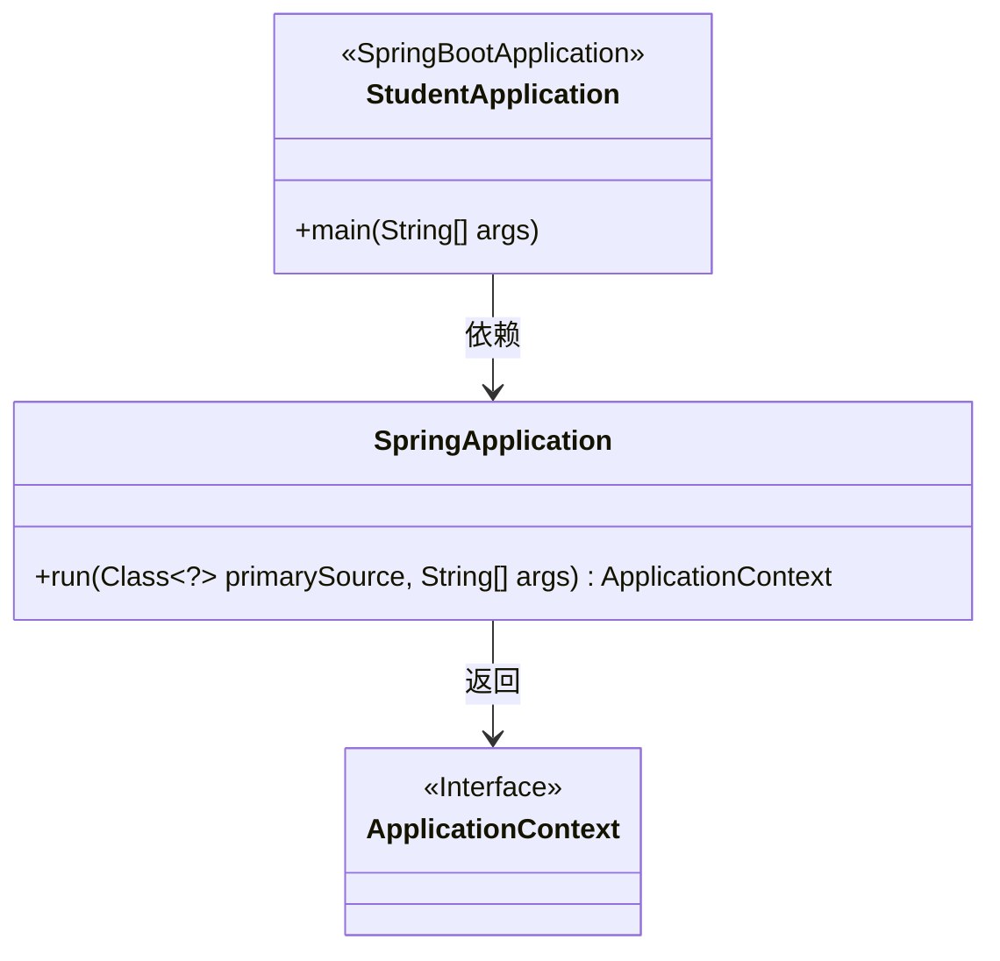
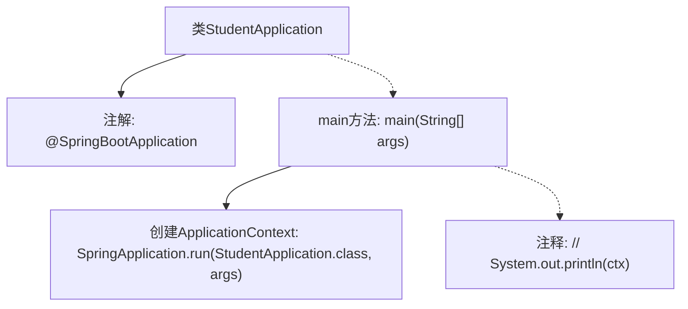

# 基础信息

|      |      |
|------|------|
| 名称 | StudentApplication |
| 编码语言 | .java |
| 代码路径 | spring-boot-examples/spring-boot-rest-services/src/main/java/com/in28minutes/springboot/StudentApplication.java |
| 包名 | com.in28minutes.springboot |
| 依赖项 | ['org.springframework.boot.SpringApplication', 'org.springframework.boot.autoconfigure.SpringBootApplication', 'org.springframework.context.ApplicationContext'] |
| 概述说明 | Spring Boot启动类StudentApplication初始化应用上下文。 |

# 说明

Spring Boot应用程序的启动类StudentApplication负责运行和初始化应用上下文。该类是应用的入口点，启动时会加载所有必要的配置和依赖，确保应用能够正确运行并准备好处理请求。通过该类的执行，Spring Boot框架会自动配置和启动应用程序，使其进入可操作状态。

# 类列表 Class Summary

| 名称   | 类型  | 说明 |
|-------|------|-------------|
| StudentApplication | class | Spring Boot应用程序启动类，运行StudentApplication并初始化应用上下文。 |

## 类 StudentApplication

|      |      |
|------|------|
| 访问范围 | @SpringBootApplication;public |
| 类型 | class |
| 名称 | StudentApplication |
| 说明 | Spring Boot应用程序启动类，运行StudentApplication并初始化应用上下文。 |

### UML类图

这段代码定义了一个Spring Boot应用程序的启动类`StudentApplication`，其中`main`方法通过`SpringApplication.run`启动Spring应用，并返回一个`ApplicationContext`对象。`StudentApplication`类标记为`@SpringBootApplication`，表明它是一个Spring Boot应用的主类。`SpringApplication`类提供了`run`方法，用于启动应用并返回应用上下文。`ApplicationContext`是一个接口，表示Spring应用上下文，用于管理Bean的生命周期和依赖注入。

### 内部方法调用关系图

这段代码是一个Spring Boot应用程序的入口类，使用了`@SpringBootApplication`注解来标记该类为Spring Boot应用的启动类。`main`方法中通过`SpringApplication.run`方法启动应用，并返回一个`ApplicationContext`对象，该对象是Spring应用上下文的核心容器。代码中注释掉的部分是用于打印上下文对象的调试信息。

### 字段列表 Field List

| 名称  | 类型  | 说明 |
|-------|-------|------|

### 方法列表 Method List

| 名称  | 类型  | 说明 |
|-------|-------|------|
| main | void | Java启动Spring应用，初始化上下文。 |

