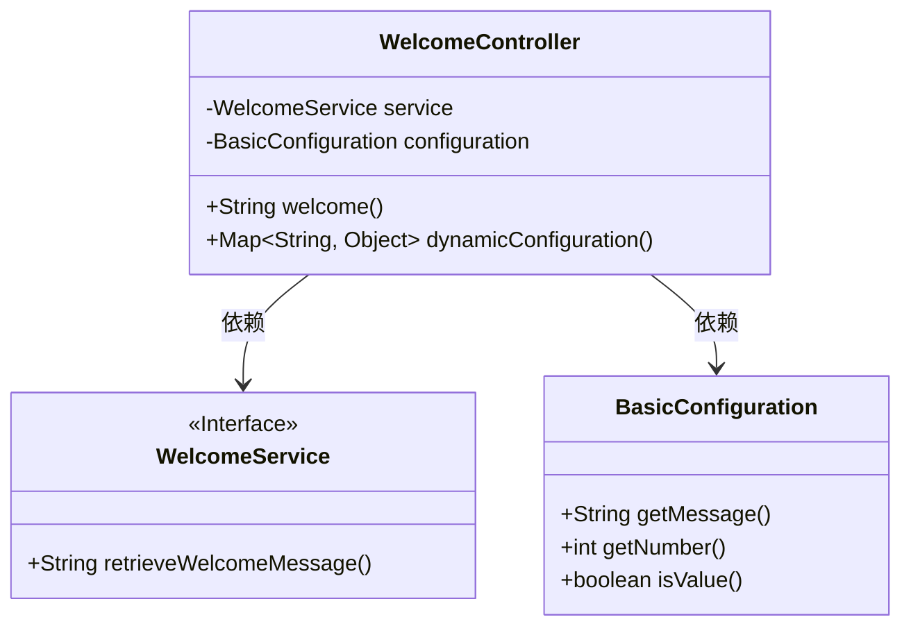
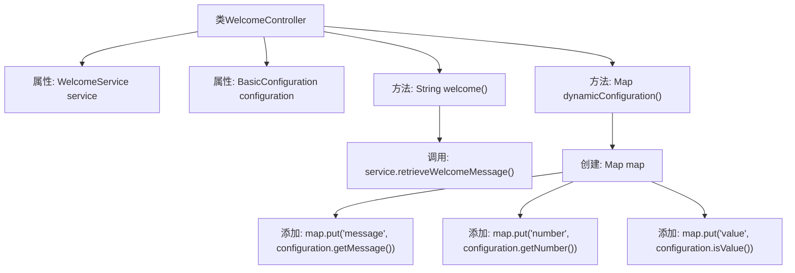

# 基础信息

|      |      |
|------|------|
| 名称 | WelcomeController |
| 编码语言 | .java |
| 代码路径 | spring-boot-examples/spring-boot-rest-services/src/main/java/com/in28minutes/springboot/WelcomeController.java |
| 包名 | com.in28minutes.springboot |
| 依赖项 | ['java.util.HashMap', 'java.util.Map', 'org.springframework.beans.factory.annotation.Autowired', 'org.springframework.web.bind.annotation.RequestMapping', 'org.springframework.web.bind.annotation.RestController', 'com.in28minutes.springboot.configuration.BasicConfiguration'] |
| 概述说明 | 欢迎控制器类提供欢迎信息及动态配置接口。 |

# 说明

欢迎控制器类是一个用于管理和提供欢迎信息的核心组件，它集成了动态配置的接口功能。该类的主要职责是展示欢迎信息，并支持通过动态配置接口灵活调整这些信息的内容或展示方式。通过动态配置，用户可以根据不同的场景或需求实时更新欢迎信息，确保其始终与当前环境或用户需求保持一致。该控制器类设计简洁高效，便于集成到各种应用场景中，提供稳定且可定制的欢迎体验。

# 类列表 Class Summary

| 名称   | 类型  | 说明 |
|-------|------|-------------|
| WelcomeController | class | 欢迎控制器类，包含欢迎信息和动态配置的接口。 |

## 类 WelcomeController

|      |      |
|------|------|
| 访问范围 | @RestController;public |
| 类型 | class |
| 名称 | WelcomeController |
| 说明 | 欢迎控制器类，包含欢迎信息和动态配置的接口。 |

### UML类图

这段代码描述了一个Spring Boot控制器 `WelcomeController`，它依赖于 `WelcomeService` 和 `BasicConfiguration` 两个类。`WelcomeController` 提供了两个接口：`/welcome` 返回欢迎信息，`/dynamic-configuration` 返回动态配置信息。`WelcomeService` 是一个接口，负责获取欢迎信息，而 `BasicConfiguration` 则提供了配置信息，包括消息、数字和布尔值。

### 内部方法调用关系图

这段代码定义了一个`WelcomeController`类，它是一个Spring Boot的REST控制器。该类通过`@Autowired`注解自动注入`WelcomeService`和`BasicConfiguration`两个依赖。`welcome()`方法处理`/welcome`请求，调用`service.retrieveWelcomeMessage()`返回欢迎信息。`dynamicConfiguration()`方法处理`/dynamic-configuration`请求，创建一个`Map`对象，并将`configuration`中的消息、数字和布尔值添加到`Map`中返回。流程图展示了类属性、方法及其调用关系。

### 字段列表 Field List

| 名称  | 类型  | 说明 |
|-------|-------|------|
| configuration | BasicConfiguration | 自动注入基本配置类的实例。 |
| service | WelcomeService | 使用@Autowired自动注入WelcomeService实例。 |

### 方法列表 Method List

| 名称  | 类型  | 说明 |
|-------|-------|------|
| welcome | String | 控制器方法映射"/welcome"，返回服务获取的欢迎信息。 |
| dynamicConfiguration | Map<String, Object> | 方法dynamicConfiguration返回包含消息、数字和布尔值的映射。 |

