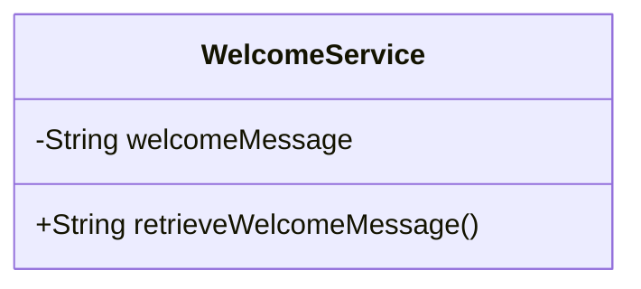
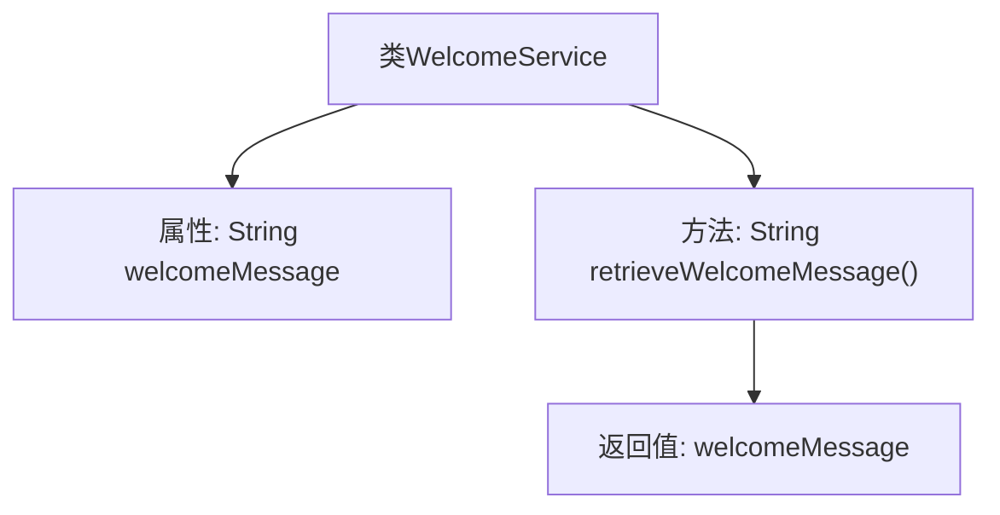

# 基础信息

|      |      |
|------|------|
| 名称 | WelcomeService |
| 编码语言 | .java |
| 代码路径 | spring-boot-examples/spring-boot-rest-services/src/main/java/com/in28minutes/springboot/WelcomeService.java |
| 包名 | com.in28minutes.springboot |
| 依赖项 | ['org.springframework.beans.factory.annotation.Value', 'org.springframework.stereotype.Service'] |
| 概述说明 | WelcomeService类注入欢迎信息并提供返回方法。 |

# 说明

WelcomeService类通过@Value注解注入欢迎信息，并提供了一个名为retrieveWelcomeMessage的方法，用于返回该欢迎信息。这个类的主要功能是管理和获取预先配置的欢迎消息。

# 类列表 Class Summary

| 名称   | 类型  | 说明 |
|-------|------|-------------|
| WelcomeService | class | WelcomeService类通过@Value注入欢迎信息，并提供retrieveWelcomeMessage方法返回该信息。 |

## 类 WelcomeService

|      |      |
|------|------|
| 访问范围 | @Service;public |
| 类型 | class |
| 名称 | WelcomeService |
| 说明 | WelcomeService类通过@Value注入欢迎信息，并提供retrieveWelcomeMessage方法返回该信息。 |

### UML类图

**描述：**  
`WelcomeService` 类是一个服务类，包含一个私有属性 `welcomeMessage`，该属性通过 `@Value` 注解从配置文件中注入。类中提供了一个公有方法 `retrieveWelcomeMessage()`，用于返回 `welcomeMessage` 的值。这个类主要用于获取并返回欢迎信息，适用于需要在应用中显示欢迎消息的场景。

### 内部方法调用关系图

这段代码定义了一个名为 `WelcomeService` 的类，其中包含一个私有属性 `welcomeMessage`，该属性通过 `@Value` 注解从配置文件中注入值。类中提供了一个公共方法 `retrieveWelcomeMessage()`，该方法返回 `welcomeMessage` 的值。流程图展示了类的结构以及方法如何访问并返回属性的值。

### 字段列表 Field List

| 名称  | 类型  | 说明 |
|-------|-------|------|
| welcomeMessage | String | 代码定义了一个私有字符串变量welcomeMessage，用于存储欢迎信息。 |

### 方法列表 Method List

| 名称  | 类型  | 说明 |
|-------|-------|------|
| retrieveWelcomeMessage | String | 方法返回欢迎信息字符串。 |

