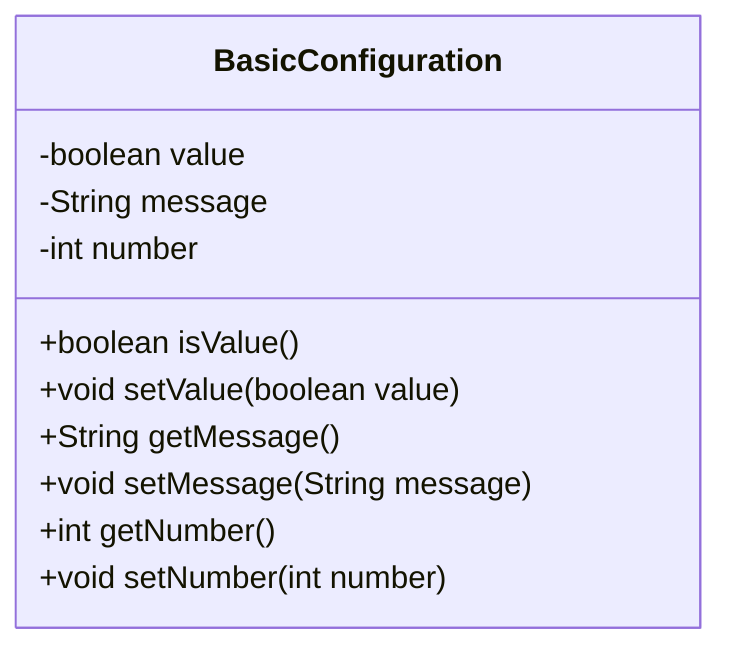
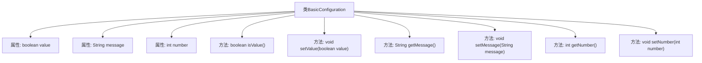

# 基础信息

|      |      |
|------|------|
| 名称 | BasicConfiguration |
| 编码语言 | .java |
| 代码路径 | spring-boot-examples/spring-boot-rest-services/src/main/java/com/in28minutes/springboot/configuration/BasicConfiguration.java |
| 包名 | com.in28minutes.springboot.configuration |
| 依赖项 | ['org.springframework.boot.context.properties.ConfigurationProperties', 'org.springframework.stereotype.Component'] |
| 概述说明 | BasicConfiguration类用于配置布尔、字符串和整数属性。 |

# 说明

BasicConfiguration类用于配置布尔值、字符串和整数属性，这些属性是类中的关键组成部分。通过该类，用户可以定义和设置不同类型的属性值，从而实现对系统或应用的基本配置。布尔值属性用于表示真或假的状态，字符串属性用于存储文本信息，整数属性则用于存储数值数据。该类提供了对这些属性的管理和操作功能，确保配置的灵活性和准确性。

# 类列表 Class Summary

| 名称   | 类型  | 说明 |
|-------|------|-------------|
| BasicConfiguration | class | BasicConfiguration类配置布尔值、字符串和整数属性。 |

## 类 BasicConfiguration

|      |      |
|------|------|
| 访问范围 | @Component;@ConfigurationProperties("basic");public |
| 类型 | class |
| 名称 | BasicConfiguration |
| 说明 | BasicConfiguration类配置布尔值、字符串和整数属性。 |

### UML类图

这段代码定义了一个名为 `BasicConfiguration` 的类，它是一个配置类，通常用于从配置文件中读取属性值。类中包含三个私有成员变量：`value`（布尔类型）、`message`（字符串类型）和 `number`（整数类型）。类提供了这些变量的getter和setter方法，用于访问和修改它们的值。通过 `@Component` 和 `@ConfigurationProperties` 注解，该类可以被Spring框架自动扫描并注入配置属性。

### 内部方法调用关系图

这段代码定义了一个名为 `BasicConfiguration` 的类，使用了 `@Component` 和 `@ConfigurationProperties` 注解，表明它是一个Spring组件，并且可以从配置文件中注入属性。类中包含三个私有属性：`value`、`message` 和 `number`，并提供了对应的getter和setter方法。这些方法用于获取和设置属性的值，确保类与外部配置的交互。

### 字段列表 Field List

| 名称  | 类型  | 说明 |
|-------|-------|------|
| message | String | 声明了一个私有的字符串类型变量message。 |
| value | boolean | 声明一个私有的布尔类型变量value。 |
| number | int | 声明一个私有的整型变量number。 |

### 方法列表 Method List

| 名称  | 类型  | 说明 |
|-------|-------|------|
| setMessage | void | 设置消息内容的Java方法。 |
| getMessage | String | 获取消息的字符串方法。 |
| setNumber | void | 设置整型变量number的值。 |
| getNumber | int | 获取并返回整数类型变量number的值。 |
| isValue | boolean | 该方法返回布尔值变量`value`的状态。 |
| setValue | void | 设置布尔类型值的公共方法。 |

