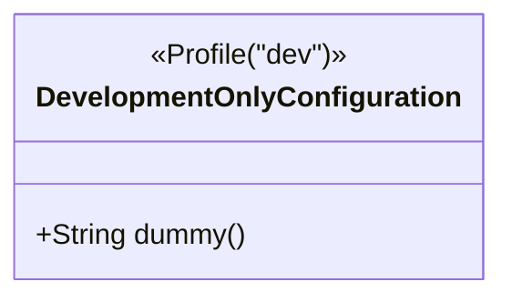
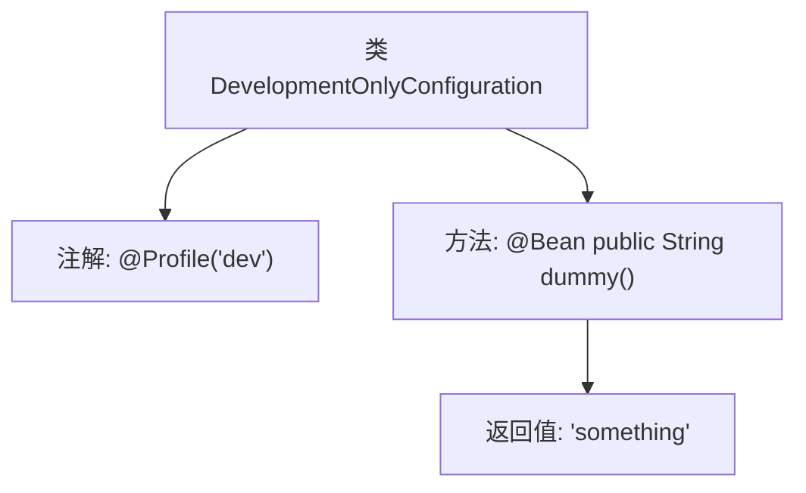

# 基础信息

|      |      |
|------|------|
| 名称 | DevelopmentOnlyConfiguration |
| 编码语言 | .java |
| 代码路径 | spring-boot-examples/spring-boot-rest-services/src/main/java/com/in28minutes/springboot/configuration/DevelopmentOnlyConfiguration.java |
| 包名 | com.in28minutes.springboot.configuration |
| 依赖项 | ['org.springframework.context.annotation.Bean', 'org.springframework.context.annotation.Profile'] |
| 概述说明 | 开发环境配置类，定义返回字符串的Bean方法。 |

# 说明

开发环境专用配置类主要用于定义返回字符串的Bean方法。该配置类专门针对开发环境进行定制，确保在开发过程中能够提供所需的字符串返回值。通过定义这些Bean方法，开发人员可以在开发环境中轻松获取所需的字符串数据，从而简化开发流程并提高效率。该配置类的设计旨在优化开发体验，确保开发环境中的字符串处理更加便捷和高效。

# 类列表 Class Summary

| 名称   | 类型  | 说明 |
|-------|------|-------------|
| DevelopmentOnlyConfiguration | class | 开发环境专用配置类，定义返回字符串的Bean方法。 |

## 类 DevelopmentOnlyConfiguration

|      |      |
|------|------|
| 访问范围 | @Profile("dev");public |
| 类型 | class |
| 名称 | DevelopmentOnlyConfiguration |
| 说明 | 开发环境专用配置类，定义返回字符串的Bean方法。 |

### UML类图

这段代码定义了一个名为 `DevelopmentOnlyConfiguration` 的类，该类仅在开发环境下生效（通过 `@Profile("dev")` 注解标记）。该类包含一个 `dummy` 方法，该方法返回一个字符串 "something"。这个类通常用于在开发环境中配置一些特定的 Bean 或服务，以便在开发过程中使用。

### 内部方法调用关系图

这段代码定义了一个名为 `DevelopmentOnlyConfiguration` 的类，该类仅在开发环境（`dev`）下生效。类中包含一个带有 `@Bean` 注解的方法 `dummy()`，该方法返回字符串 `"something"`。流程图展示了类的结构以及方法之间的调用关系，强调了注解和方法之间的关联。

### 字段列表 Field List

| 名称  | 类型  | 说明 |
|-------|-------|------|

### 方法列表 Method List

| 名称  | 类型  | 说明 |
|-------|-------|------|
| dummy | String | 定义Bean方法dummy，返回字符串"something"。 |

