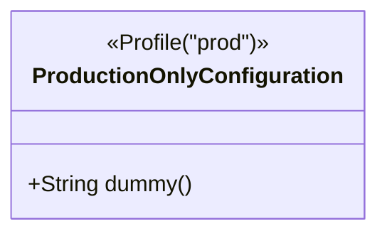
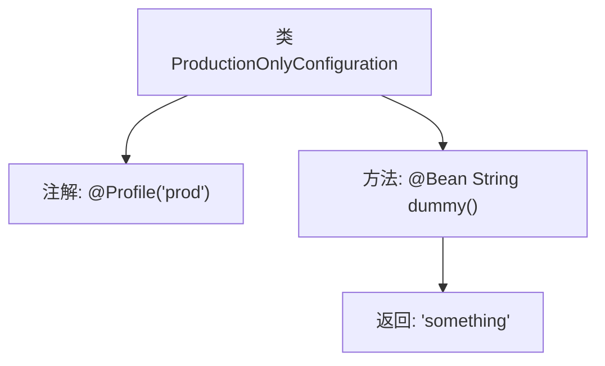

# 基础信息

|      |      |
|------|------|
| 名称 | ProductionOnlyConfiguration |
| 编码语言 | .java |
| 代码路径 | spring-boot-examples/spring-boot-rest-services/src/main/java/com/in28minutes/springboot/configuration/ProductionOnlyConfiguration.java |
| 包名 | com.in28minutes.springboot.configuration |
| 依赖项 | ['org.springframework.context.annotation.Bean', 'org.springframework.context.annotation.Profile'] |
| 概述说明 | 生产环境配置类包含返回固定字符串的Bean方法。 |

# 说明

生产环境配置类定义了一个Bean方法，该方法返回一个固定的字符串。该配置类用于在生产环境中进行特定设置，确保系统在运行时能够按照预期返回指定的字符串值。此配置类的主要作用是简化生产环境中的配置管理，通过预定义的方法减少重复代码和配置错误的风险，从而提高系统的稳定性和可维护性。

# 类列表 Class Summary

| 名称   | 类型  | 说明 |
|-------|------|-------------|
| ProductionOnlyConfiguration | class | 生产环境配置类，包含返回固定字符串的Bean方法。 |

## 类 ProductionOnlyConfiguration

|      |      |
|------|------|
| 访问范围 | @Profile("prod");public |
| 类型 | class |
| 名称 | ProductionOnlyConfiguration |
| 说明 | 生产环境配置类，包含返回固定字符串的Bean方法。 |

### UML类图

这段代码定义了一个名为 `ProductionOnlyConfiguration` 的类，该类被标记为仅在生产环境（`prod`）下生效。类中包含一个公有方法 `dummy()`，该方法返回一个字符串 "something"。通过 `@Profile("prod")` 注解，该类及其方法只有在生产环境配置下才会被加载和执行。

### 内部方法调用关系图

这段代码定义了一个名为`ProductionOnlyConfiguration`的类，该类仅在生产环境（`prod`）下生效，通过`@Profile("prod")`注解实现。类中包含一个`@Bean`注解的方法`dummy()`，该方法返回字符串`"something"`。流程图展示了类的结构及其方法调用关系，清晰地描述了类的注解和方法之间的逻辑关系。

### 字段列表 Field List

| 名称  | 类型  | 说明 |
|-------|-------|------|

### 方法列表 Method List

| 名称  | 类型  | 说明 |
|-------|-------|------|
| dummy | String | 定义一个Bean方法，返回字符串"something"。 |

