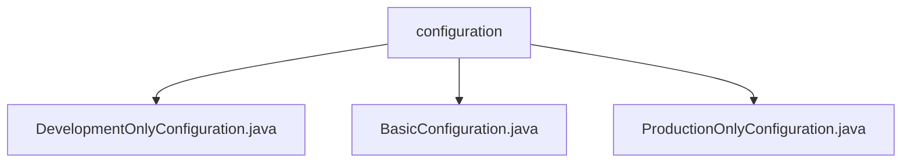

# 基础信息

|      |      |
|------|------|
| 名称 | configuration |
| 编码语言 | .java |
| 代码路径 | spring-boot-examples/spring-boot-rest-services/src/main/java/com/in28minutes/springboot/configuration |
| 包名 | spring-boot-examples.spring-boot-rest-services.src.main.java.com.in28minutes.springboot.configuration |
| 概述说明 | 开发环境配置类定义字符串Bean，优化开发流程。基本配置类管理布尔、字符串和整数属性。生产环境配置类返回固定字符串，简化配置管理。 |

# 说明

## 概述

该代码模块主要包含三个配置类，分别针对开发环境、生产环境以及基本配置进行定制。这些配置类通过定义不同的Bean方法，简化了开发和生产环境中的配置管理，提高了系统的灵活性和可维护性。开发环境配置类专注于返回特定的字符串数据，生产环境配置类则确保在生产环境中返回固定的字符串值，而基本配置类则提供了对布尔值、字符串和整数属性的管理和操作功能。

## 主要业务场景

1. **开发环境配置**：在开发过程中，开发人员需要获取特定的字符串数据以简化开发流程。开发环境专用配置类通过定义返回字符串的Bean方法，确保在开发环境中能够轻松获取所需的字符串数据，从而提高开发效率。

2. **生产环境配置**：在生产环境中，系统需要按照预期返回指定的字符串值，以确保系统的稳定性和一致性。生产环境配置类通过定义返回固定字符串的Bean方法，简化了生产环境中的配置管理，减少了重复代码和配置错误的风险。

3. **基本配置管理**：在系统或应用的基本配置中，布尔值、字符串和整数属性是关键组成部分。基本配置类提供了对这些属性的管理和操作功能，确保配置的灵活性和准确性，从而满足不同场景下的配置需求。

### 包内部结构视图

该流程图展示了Spring Boot项目中配置文件的层级关系。`configuration`文件夹下包含三个配置文件：`DevelopmentOnlyConfiguration.java`、`BasicConfiguration.java`和`ProductionOnlyConfiguration.java`。这些文件分别用于开发环境、基础配置和生产环境的配置管理，体现了模块化设计的思想。

# 文件列表 File List

| 名称   | 类型  | 说明 |
|-------|------|-------------|
| [ProductionOnlyConfiguration.java](ProductionOnlyConfiguration.md) | file | 生产环境配置类包含返回固定字符串的Bean方法。 |
| [BasicConfiguration.java](BasicConfiguration.md) | file | BasicConfiguration类用于配置布尔、字符串和整数属性。 |
| [DevelopmentOnlyConfiguration.java](DevelopmentOnlyConfiguration.md) | file | 开发环境配置类，定义返回字符串的Bean方法。 |

