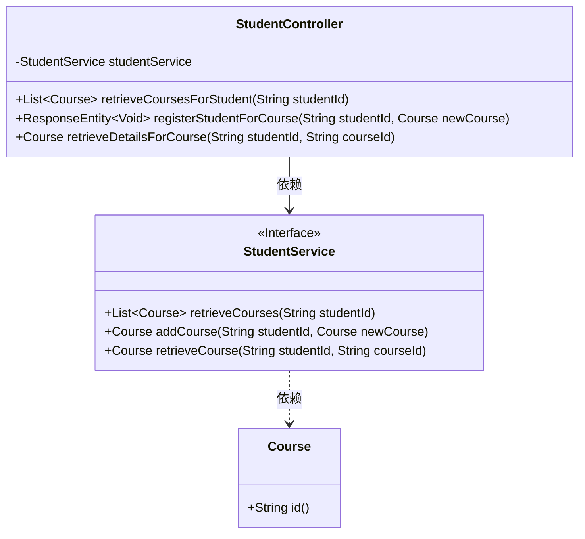
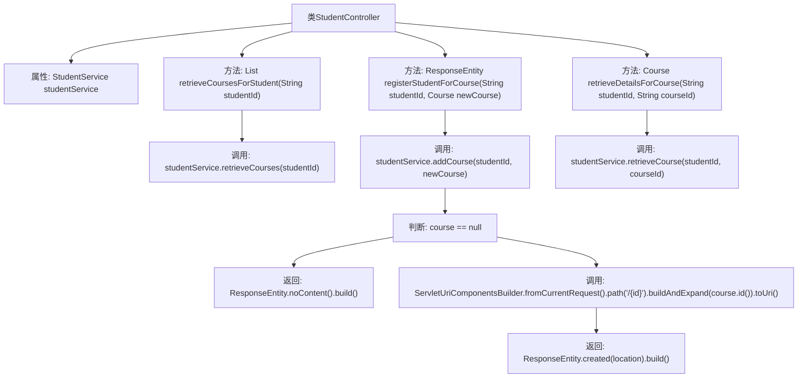

# 基础信息

|      |      |
|------|------|
| 名称 | StudentController |
| 编码语言 | .java |
| 代码路径 | spring-boot-examples/spring-boot-rest-services/src/main/java/com/in28minutes/springboot/controller/StudentController.java |
| 包名 | com.in28minutes.springboot.controller |
| 依赖项 | ['java.net.URI', 'java.util.List', 'org.springframework.beans.factory.annotation.Autowired', 'org.springframework.http.ResponseEntity', 'org.springframework.web.bind.annotation.GetMapping', 'org.springframework.web.bind.annotation.PathVariable', 'org.springframework.web.bind.annotation.PostMapping', 'org.springframework.web.bind.annotation.RequestBody', 'org.springframework.web.bind.annotation.RequestMapping', 'org.springframework.web.bind.annotation.RestController', 'org.springframework.web.servlet.support.ServletUriComponentsBuilder', 'com.in28minutes.springboot.model.Course', 'com.in28minutes.springboot.service.StudentService'] |
| 概述说明 | StudentController负责处理学生课程请求，涵盖获取、注册及查询详情功能。 |

# 说明

StudentController负责处理与学生课程相关的各类请求，主要功能包括获取学生课程列表、处理学生注册课程的请求以及查询特定课程的详细信息。该控制器确保学生能够顺利访问和管理其课程信息，提供全面的课程操作支持。

# 类列表 Class Summary

| 名称   | 类型  | 说明 |
|-------|------|-------------|
| StudentController | class | StudentController处理学生课程相关请求，包括获取课程、注册课程和查询课程详情。 |

## 类 StudentController

|      |      |
|------|------|
| 访问范围 | @RestController;@RequestMapping("/students/{studentId}/courses");public |
| 类型 | class |
| 名称 | StudentController |
| 说明 | StudentController处理学生课程相关请求，包括获取课程、注册课程和查询课程详情。 |

### UML类图

这段代码定义了一个`StudentController`类，它通过`StudentService`接口处理与课程相关的HTTP请求。`StudentController`类包含三个方法：`retrieveCoursesForStudent`用于获取学生的课程列表，`registerStudentForCourse`用于注册学生的新课程，`retrieveDetailsForCourse`用于获取特定课程的详细信息。`StudentService`接口定义了三个方法，分别用于检索课程、添加课程和获取课程详情。`Course`类表示课程对象，包含一个`id`方法。`StudentController`依赖于`StudentService`，而`StudentService`依赖于`Course`。

### 内部方法调用关系图

这段代码是一个Spring Boot的REST控制器，用于管理学生的课程信息。它包含三个主要方法：`retrieveCoursesForStudent`用于获取学生的所有课程，`registerStudentForCourse`用于注册学生的新课程，`retrieveDetailsForCourse`用于获取特定课程的详细信息。每个方法都依赖于`StudentService`来处理业务逻辑，并根据不同的情况返回相应的HTTP响应。

### 字段列表 Field List

| 名称  | 类型  | 说明 |
|-------|-------|------|
| studentService | StudentService | 自动注入StudentService实例。 |

### 方法列表 Method List

| 名称  | 类型  | 说明 |
|-------|-------|------|
| retrieveCoursesForStudent | List<Course> | 通过学生ID获取其课程列表。 |
| retrieveDetailsForCourse | Course | 通过学生ID和课程ID获取课程详细信息。 |
| registerStudentForCourse | ResponseEntity<Void> | 注册学生课程接口，成功返回201，失败返回204。 |

