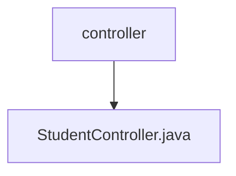

# 基础信息

|      |      |
|------|------|
| 名称 | controller |
| 编码语言 | .java |
| 代码路径 | spring-boot-examples/spring-boot-rest-services/src/main/java/com/in28minutes/springboot/controller |
| 包名 | spring-boot-examples.spring-boot-rest-services.src.main.java.com.in28minutes.springboot.controller |
| 概述说明 | StudentController负责处理学生课程请求，涵盖获取、注册及查询详情功能。 |

# 说明

StudentController负责处理与学生课程相关的各类请求，主要功能包括获取学生课程列表、处理学生注册课程的请求以及查询特定课程的详细信息。该控制器确保学生能够顺利访问和管理其课程信息，提供全面的课程操作支持。

### 包内部结构视图

该流程图展示了Spring Boot项目中控制器层的结构，`controller`文件夹下包含`StudentController.java`文件，表示这是一个处理学生相关请求的控制器类。

# 文件列表 File List

| 名称   | 类型  | 说明 |
|-------|------|-------------|
| [StudentController.java](StudentController.md) | file | StudentController负责处理学生课程请求，涵盖获取、注册及查询详情功能。 |

