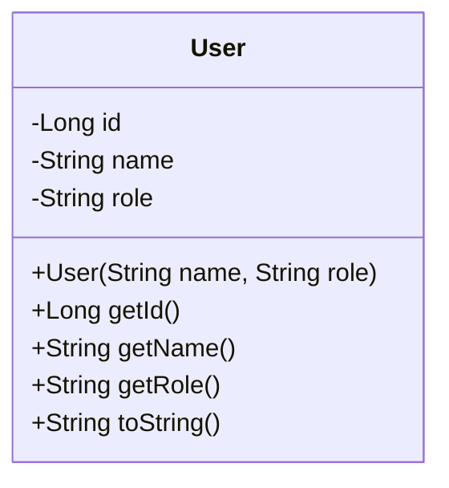
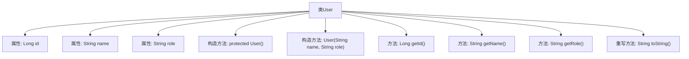

# 基础信息

|      |      |
|------|------|
| 名称 | User |
| 编码语言 | .java |
| 代码路径 | spring-boot-examples/spring-boot-rest-services/src/main/java/com/in28minutes/springboot/jpa/User.java |
| 包名 | com.in28minutes.springboot.jpa |
| 依赖项 | ['jakarta.persistence.Entity', 'jakarta.persistence.GeneratedValue', 'jakarta.persistence.GenerationType', 'jakarta.persistence.Id'] |
| 概述说明 | 用户实体类包含ID、姓名、角色属性，提供构造和访问方法。 |

# 说明

用户实体类是一个基础的数据结构，用于表示用户的基本信息。该类包含三个主要属性：ID、姓名和角色。ID用于唯一标识用户，姓名存储用户的名称，角色则定义用户的权限或身份。类中提供了构造方法，用于在创建对象时初始化这些属性。此外，还提供了访问器方法，允许外部代码获取或修改这些属性的值。该实体类设计简洁，便于在应用程序中管理和操作用户数据。

# 类列表 Class Summary

| 名称   | 类型  | 说明 |
|-------|------|-------------|
| User | class | 用户实体类，包含ID、姓名和角色属性，提供构造方法和访问器。 |

## 类 User

|      |      |
|------|------|
| 访问范围 | @Entity;public |
| 类型 | class |
| 名称 | User |
| 说明 | 用户实体类，包含ID、姓名和角色属性，提供构造方法和访问器。 |

### UML类图

这段代码定义了一个名为 `User` 的实体类，包含三个私有属性：`id`、`name` 和 `role`。`id` 是自动生成的主键，`name` 和 `role` 分别表示用户的名称和角色。类中提供了两个构造函数：一个无参的受保护构造函数和一个带参数的公有构造函数。此外，还提供了获取 `id`、`name` 和 `role` 的公有方法，并重写了 `toString` 方法以返回对象的字符串表示。这个类通常用于表示系统中的用户实体，并可能与数据库进行映射。

### 内部方法调用关系图

这段代码定义了一个名为 `User` 的实体类，包含三个属性：`id`、`name` 和 `role`。类中有两个构造方法，一个默认的受保护构造方法和一个带参数的构造方法。此外，类还提供了获取属性值的方法 `getId()`、`getName()` 和 `getRole()`，以及重写的 `toString()` 方法，用于返回对象的字符串表示。该类的设计主要用于存储用户信息，并通过方法访问这些信息。

### 字段列表 Field List

| 名称  | 类型  | 说明 |
|-------|-------|------|
| id | Long | 实体类中自动生成的主键ID字段。 |
| name | String | 声明了一个私有的字符串类型变量name。 |
| role | String | 定义了一个私有字符串变量role。 |

### 方法列表 Method List

| 名称  | 类型  | 说明 |
|-------|-------|------|
| getRole | String | 获取角色属性的方法。 |
| getId | Long | 获取对象的唯一标识符ID。 |
| getName | String | 该方法返回字符串类型的变量name。 |
| toString | String | 重写toString方法，返回用户ID、名称和角色信息。 |

