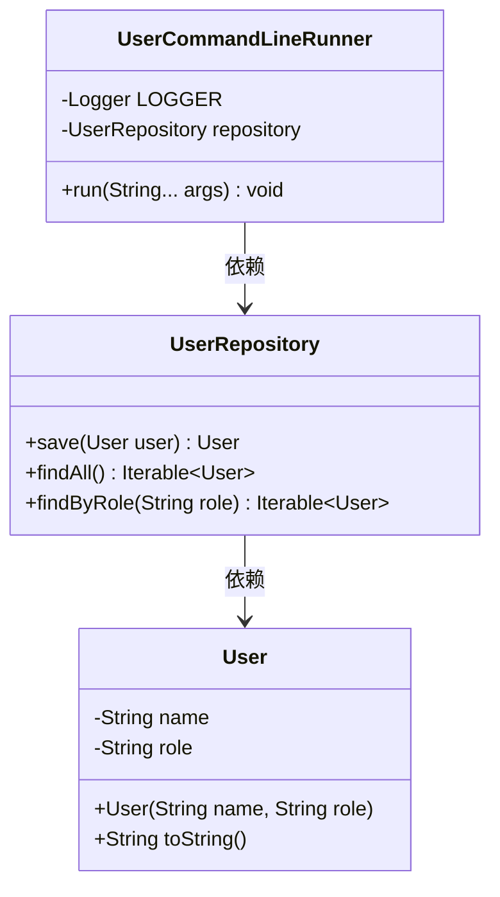
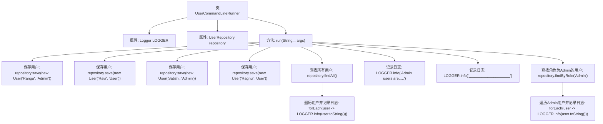

# 基础信息

|      |      |
|------|------|
| 名称 | UserCommandLineRunner |
| 编码语言 | .java |
| 代码路径 | spring-boot-examples/spring-boot-rest-services/src/main/java/com/in28minutes/springboot/jpa/UserCommandLineRunner.java |
| 包名 | com.in28minutes.springboot.jpa |
| 依赖项 | ['org.slf4j.Logger', 'org.slf4j.LoggerFactory', 'org.springframework.beans.factory.annotation.Autowired', 'org.springframework.boot.CommandLineRunner', 'org.springframework.stereotype.Component'] |
| 概述说明 | UserCommandLineRunner类初始化用户数据，记录用户并筛选管理员信息。 |

# 说明

UserCommandLineRunner类负责初始化并保存用户数据，同时记录所有用户信息，并从中筛选出管理员的相关信息。该类的核心功能包括数据初始化和存储，以及对用户信息的管理和分类，确保管理员信息能够被有效识别和提取。

# 类列表 Class Summary

| 名称   | 类型  | 说明 |
|-------|------|-------------|
| UserCommandLineRunner | class | UserCommandLineRunner类初始化并保存用户数据，记录所有用户并筛选管理员信息。 |

## 类 UserCommandLineRunner

|      |      |
|------|------|
| 访问范围 | @Component;public |
| 类型 | class |
| 名称 | UserCommandLineRunner |
| 说明 | UserCommandLineRunner类初始化并保存用户数据，记录所有用户并筛选管理员信息。 |

### UML类图

这段代码定义了一个 `UserCommandLineRunner` 类，该类实现了 `CommandLineRunner` 接口，用于在应用程序启动时执行一些初始化操作。`UserCommandLineRunner` 依赖 `UserRepository` 来保存和查询用户数据。`UserRepository` 提供了保存用户、查找所有用户以及根据角色查找用户的方法。`User` 类表示用户实体，包含用户的名称和角色信息。通过 `UserCommandLineRunner` 的 `run` 方法，程序会保存几个用户到数据库中，并输出所有用户以及特定角色的用户信息。

### 内部方法调用关系图

这段代码定义了一个`UserCommandLineRunner`类，实现了`CommandLineRunner`接口，用于在应用启动时执行一些初始化操作。代码首先通过`UserRepository`保存了四个用户，然后查找并记录所有用户的信息，最后专门查找并记录角色为`Admin`的用户信息。流程图展示了代码的执行流程，从类的定义到各个方法的调用顺序，清晰地反映了数据的保存、查询和日志记录的整个过程。

### 字段列表 Field List

| 名称  | 类型  | 说明 |
|-------|-------|------|
| LOGGER = LoggerFactory.getLogger(UserCommandLineRunner.class) | Logger | 定义静态常量LOGGER用于记录UserCommandLineRunner类的日志。 |
| repository | UserRepository | 自动注入UserRepository实例到repository变量。 |

### 方法列表 Method List

| 名称  | 类型  | 说明 |
|-------|-------|------|
| run | void | 保存用户信息并记录管理员用户日志。 |

