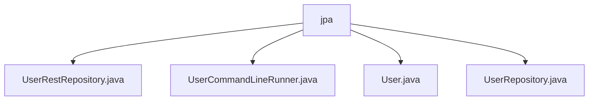

# 基础信息

|      |      |
|------|------|
| 名称 | jpa |
| 编码语言 | .java |
| 代码路径 | spring-boot-examples/spring-boot-rest-services/src/main/java/com/in28minutes/springboot/jpa |
| 包名 | spring-boot-examples.spring-boot-rest-services.src.main.java.com.in28minutes.springboot.jpa |
| 概述说明 | UserCommandLineRunner类初始化用户数据并筛选管理员信息。User类表示用户基本信息，包含ID、姓名和角色属性。 |

# 说明

## 概述
该代码模块是一个基于Spring Boot的REST服务应用程序，主要用于管理和操作用户数据。模块中包含多个类，分别负责用户数据的初始化、存储、检索以及用户实体的定义。通过这些类的协作，应用程序能够有效地管理用户信息，并支持对用户角色的分类和筛选。

## 主要业务场景
1. **用户数据初始化与存储**：`UserCommandLineRunner`类负责在应用程序启动时初始化用户数据，并将这些数据保存到数据库中。同时，该类还记录所有用户信息，并从中筛选出管理员的相关信息，确保管理员信息能够被有效识别和提取。

2. **用户实体管理**：`User`类是一个基础的数据结构，用于表示用户的基本信息。该类包含三个主要属性：ID、姓名和角色。ID用于唯一标识用户，姓名存储用户的名称，角色则定义用户的权限或身份。类中提供了构造方法和访问器方法，便于在应用程序中管理和操作用户数据。

3. **用户数据检索**：`UserRepository`类（尽管描述为空，但通常此类会负责）负责与数据库进行交互，提供对用户数据的检索、保存、更新和删除等操作。通过该类，应用程序能够方便地访问和操作存储在数据库中的用户信息。

4. **REST服务接口**：`UserRestRepository`类（尽管描述为空，但通常此类会负责）提供RESTful API接口，允许外部系统通过HTTP请求与用户数据进行交互。这些接口可能包括获取所有用户信息、获取特定用户信息、创建新用户、更新用户信息以及删除用户等操作。

通过这些业务场景，该代码模块能够为用户数据的管理提供一个完整的解决方案，支持从数据初始化到数据检索和操作的完整流程。

### 包内部结构视图

该流程图展示了`spring-boot-examples`项目中`jpa`目录下的文件结构。`jpa`作为根节点，包含了四个文件：`UserRestRepository.java`、`UserCommandLineRunner.java`、`User.java`和`UserRepository.java`。这些文件都与Spring Boot的JPA功能相关，分别用于实现REST仓库、命令行运行器、用户实体和用户仓库的类。

# 文件列表 File List

| 名称   | 类型  | 说明 |
|-------|------|-------------|
| [UserRepository.java](UserRepository.md) | file | 无内容可总结。 |
| [User.java](User.md) | file | 用户实体类包含ID、姓名、角色属性，提供构造和访问方法。 |
| [UserRestRepository.java](UserRestRepository.md) | file | 无内容提供，无法生成概要描述。 |
| [UserCommandLineRunner.java](UserCommandLineRunner.md) | file | UserCommandLineRunner类初始化用户数据，记录用户并筛选管理员信息。 |

