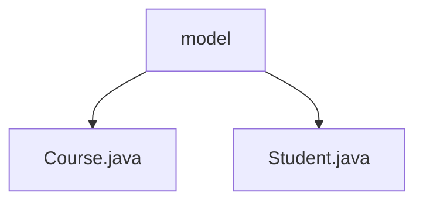

# 基础信息

|      |      |
|------|------|
| 名称 | model |
| 编码语言 | .java |
| 代码路径 | spring-boot-examples/spring-boot-rest-services/src/main/java/com/in28minutes/springboot/model |
| 包名 | spring-boot-examples.spring-boot-rest-services.src.main.java.com.in28minutes.springboot.model |
| 概述说明 | 输入内容为空，无法生成总结描述。 |

# 说明

## 概述
该代码模块是一个基于Spring Boot的REST服务示例项目，主要涉及学生和课程的管理。项目中包含两个核心模型类：`Course.java` 和 `Student.java`，分别用于表示课程和学生的数据结构。这些类通常用于定义业务实体的属性和行为，并为后续的业务逻辑处理提供基础。

## 主要业务场景
1. **课程管理**：通过`Course.java`类，定义课程的基本属性，如课程ID、名称、描述等，支持对课程信息的增删改查操作。
2. **学生管理**：通过`Student.java`类，定义学生的基本信息，如学生ID、姓名、年龄等，支持对学生信息的增删改查操作。
3. **REST服务**：基于Spring Boot框架，提供RESTful API接口，支持通过HTTP请求对课程和学生数据进行操作，实现前后端分离的Web应用开发。

该模块适用于教育管理系统、在线学习平台等场景，能够有效管理课程和学生信息，并通过REST API提供服务接口。

### 包内部结构视图

该流程图展示了在`model`文件夹下的两个Java文件：`Course.java`和`Student.java`。`model`作为父节点，直接包含这两个文件，清晰地反映了它们之间的层级关系。

# 文件列表 File List

| 名称   | 类型  | 说明 |
|-------|------|-------------|
| [Student.java](Student.md) | file | 信息为空，无法生成概要描述。 |
| [Course.java](Course.md) | file | 信息为空，无法生成概要描述。 |

