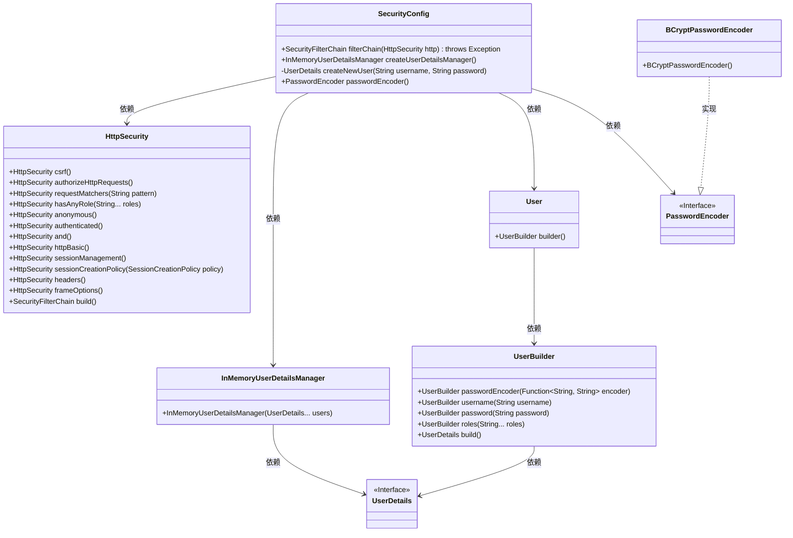
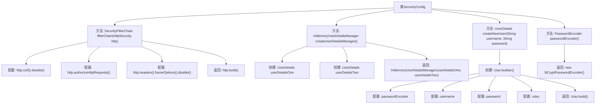

# 基础信息

|      |      |
|------|------|
| 名称 | SecurityConfig |
| 编码语言 | .java |
| 代码路径 | spring-boot-examples/spring-boot-rest-services/src/main/java/com/in28minutes/springboot/security/SecurityConfig.java |
| 包名 | com.in28minutes.springboot.security |
| 依赖项 | ['java.util.function.Function', 'org.springframework.context.annotation.Bean', 'org.springframework.context.annotation.Configuration', 'org.springframework.security.config.annotation.web.builders.HttpSecurity', 'org.springframework.security.config.annotation.web.configuration.EnableWebSecurity', 'org.springframework.security.config.http.SessionCreationPolicy', 'org.springframework.security.core.userdetails.User', 'org.springframework.security.core.userdetails.UserDetails', 'org.springframework.security.crypto.bcrypt.BCryptPasswordEncoder', 'org.springframework.security.crypto.password.PasswordEncoder', 'org.springframework.security.provisioning.InMemoryUserDetailsManager', 'org.springframework.security.web.SecurityFilterChain'] |
| 概述说明 | 配置Spring Security，禁用CSRF，设角色控制，用HTTP Basic认证，管理会话。 |

# 说明

配置Spring Security涉及多个关键步骤。首先，禁用CSRF（跨站请求伪造）保护，以减少开发复杂性。其次，设置角色访问控制，确保不同用户角色拥有相应的访问权限。接着，使用HTTP Basic认证，通过用户名和密码进行简单身份验证。最后，管理会话状态，确保用户登录状态的安全性和一致性。这些步骤共同确保应用程序的安全性和用户访问控制的有效性。

# 类列表 Class Summary

| 名称   | 类型  | 说明 |
|-------|------|-------------|
| SecurityConfig | class | 配置Spring Security，禁用CSRF，设置角色访问控制，使用HTTP Basic认证，管理会话状态。 |

## 类 SecurityConfig

|      |      |
|------|------|
| 访问范围 | @Configuration;@EnableWebSecurity;public |
| 类型 | class |
| 名称 | SecurityConfig |
| 说明 | 配置Spring Security，禁用CSRF，设置角色访问控制，使用HTTP Basic认证，管理会话状态。 |

### UML类图

这段代码定义了一个Spring Security配置类`SecurityConfig`，用于配置Web应用的安全策略。它通过`filterChain`方法禁用CSRF保护，并定义了不同URL路径的访问权限。`createUserDetailsManager`方法创建了一个内存中的用户管理器，`createNewUser`方法用于创建用户，`passwordEncoder`方法返回一个BCrypt密码编码器。类图展示了这些类及其依赖关系，`BCryptPasswordEncoder`实现了`PasswordEncoder`接口。

### 内部方法调用关系图

这段代码是一个Spring Security配置类，用于定义安全过滤链、用户管理和密码编码器。`SecurityConfig`类通过`filterChain`方法配置了CSRF保护、请求授权、HTTP基本认证和无状态会话管理。`createUserDetailsManager`方法创建了两个用户，并通过`createNewUser`方法设置了用户名、密码和角色。`passwordEncoder`方法返回了一个BCrypt密码编码器实例。整体流程展示了如何配置Spring Security以保护应用程序的安全。

### 字段列表 Field List

| 名称  | 类型  | 说明 |
|-------|-------|------|

### 方法列表 Method List

| 名称  | 类型  | 说明 |
|-------|-------|------|
| createUserDetailsManager | InMemoryUserDetailsManager | 创建包含用户和管理员的内存用户管理器。 |
| passwordEncoder | PasswordEncoder | 定义Bean方法返回BCryptPasswordEncoder实例。 |
| createNewUser | UserDetails | 创建新用户方法，使用密码编码器，设置用户名、密码和角色。 |
| filterChain | SecurityFilterChain | 配置安全过滤器链，禁用CSRF，设置角色权限，使用HTTP基本认证，无状态会话管理。 |

