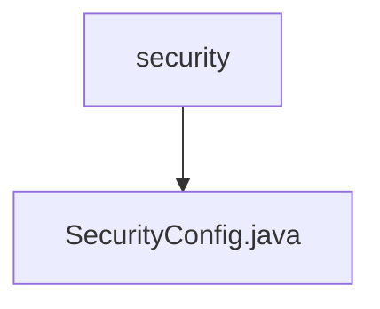

# 基础信息

|      |      |
|------|------|
| 名称 | security |
| 编码语言 | .java |
| 代码路径 | spring-boot-examples/spring-boot-rest-services/src/main/java/com/in28minutes/springboot/security |
| 包名 | spring-boot-examples.spring-boot-rest-services.src.main.java.com.in28minutes.springboot.security |
| 概述说明 | 配置Spring Security，禁用CSRF，设角色控制，用HTTP Basic认证，管理会话。 |

# 说明

配置Spring Security涉及多个关键步骤。首先，禁用CSRF（跨站请求伪造）保护，以减少开发复杂性。其次，设置角色访问控制，确保不同用户角色拥有相应的访问权限。接着，使用HTTP Basic认证，通过用户名和密码进行简单身份验证。最后，管理会话状态，确保用户登录状态的安全性和一致性。这些步骤共同确保应用程序的安全性和用户访问控制的有效性。

### 包内部结构视图

该流程图展示了`spring-boot-rest-services`项目中`security`文件夹与`SecurityConfig.java`文件之间的层级关系。`security`作为父节点，包含了一个子节点`SecurityConfig.java`，表示该配置文件位于`security`文件夹内。

# 文件列表 File List

| 名称   | 类型  | 说明 |
|-------|------|-------------|
| [SecurityConfig.java](SecurityConfig.md) | file | 配置Spring Security，禁用CSRF，设角色控制，用HTTP Basic认证，管理会话。 |

