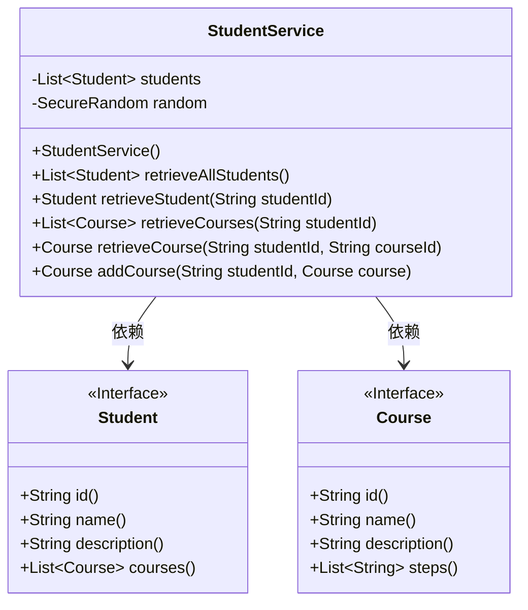
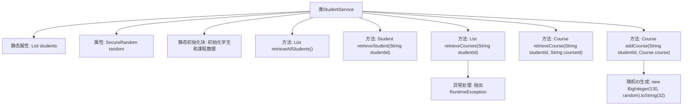

# 基础信息

|      |      |
|------|------|
| 名称 | StudentService |
| 编码语言 | .java |
| 代码路径 | spring-boot-examples/spring-boot-rest-services/src/main/java/com/in28minutes/springboot/service/StudentService.java |
| 包名 | com.in28minutes.springboot.service |
| 依赖项 | ['java.math.BigInteger', 'java.security.SecureRandom', 'java.util.ArrayList', 'java.util.Collections', 'java.util.List', 'com.in28minutes.springboot.model.Course', 'com.in28minutes.springboot.model.Student', 'org.springframework.stereotype.Service'] |
| 概述说明 | StudentService类负责管理学生及课程，支持查询和添加功能，同时处理异常。 |

# 说明

StudentService类负责管理学生及其相关课程信息，主要提供查询和添加学生及课程的功能。此外，该类还具备处理异常的能力，确保在操作过程中能够有效应对可能出现的错误或异常情况，从而保证系统的稳定性和数据的完整性。

# 类列表 Class Summary

| 名称   | 类型  | 说明 |
|-------|------|-------------|
| StudentService | class | StudentService类管理学生及其课程，提供查询、添加功能，并处理异常。 |

## 类 StudentService

|      |      |
|------|------|
| 访问范围 | @Service;public |
| 类型 | class |
| 名称 | StudentService |
| 说明 | StudentService类管理学生及其课程，提供查询、添加功能，并处理异常。 |

### UML类图

**描述：**  
`StudentService` 类负责管理学生和课程的数据。它包含一个静态的学生列表 `students`，并在静态初始化块中初始化了一些默认数据。`StudentService` 提供了多个方法，如 `retrieveAllStudents` 用于获取所有学生，`retrieveStudent` 用于根据学生ID查找学生，`retrieveCourses` 用于获取学生的课程列表，`retrieveCourse` 用于根据课程ID查找课程，以及 `addCourse` 用于向学生添加课程。`Student` 和 `Course` 是接口，分别定义了学生和课程的基本属性和方法。`StudentService` 依赖于 `Student` 和 `Course` 接口来操作数据。

### 内部方法调用关系图

**描述：**
该流程图展示了`StudentService`类的结构及其方法调用关系。类中包含静态初始化块用于初始化学生和课程数据，并提供多个方法用于检索学生、课程信息以及添加课程。其中，`retrieveCourses`方法在特定条件下会抛出异常，`addCourse`方法会生成随机ID并添加课程。流程图清晰地展示了各个方法之间的调用顺序和逻辑关系。

### 字段列表 Field List

| 名称  | 类型  | 说明 |
|-------|-------|------|
| random = new SecureRandom() | SecureRandom | 使用SecureRandom生成安全的随机数实例。 |
| students = new ArrayList<>() | List<Student> | 定义一个私有的静态最终学生列表。 |

### 方法列表 Method List

| 名称  | 类型  | 说明 |
|-------|-------|------|
| retrieveAllStudents | List<Student> | 方法返回所有学生对象的列表。 |
| retrieveCourse | Course | 根据学生ID和课程ID查询学生对应的课程信息。 |
| retrieveStudent | Student | 通过学生ID从列表中检索并返回对应学生对象。 |
| retrieveCourses | List<Course> | 方法通过学生ID获取课程，若ID为"Student1"则抛出异常，否则返回学生课程列表。 |
| addCourse | Course | 方法为指定学生添加课程，生成随机ID，若学生不存在返回null。 |

