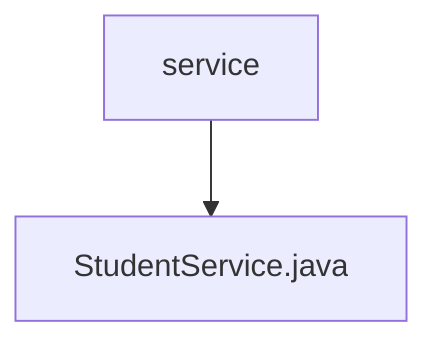

# 基础信息

|      |      |
|------|------|
| 名称 | service |
| 编码语言 | .java |
| 代码路径 | spring-boot-examples/spring-boot-rest-services/src/main/java/com/in28minutes/springboot/service |
| 包名 | spring-boot-examples.spring-boot-rest-services.src.main.java.com.in28minutes.springboot.service |
| 概述说明 | StudentService类负责管理学生及课程，支持查询和添加功能，同时处理异常。 |

# 说明

StudentService类负责管理学生及其相关课程信息，主要提供查询和添加学生及课程的功能。此外，该类还具备处理异常的能力，确保在操作过程中能够有效应对可能出现的错误或异常情况，从而保证系统的稳定性和数据的完整性。

### 包内部结构视图

该流程图展示了`spring-boot-examples`项目中`spring-boot-rest-services`模块的`service`目录结构。`service`目录下包含一个`StudentService.java`文件，表示该文件是`service`目录的直接子节点。整个结构简单明了，反映了项目中的服务层文件组织方式。

# 文件列表 File List

| 名称   | 类型  | 说明 |
|-------|------|-------------|
| [StudentService.java](StudentService.md) | file | StudentService类负责管理学生及课程，支持查询和添加功能，同时处理异常。 |

