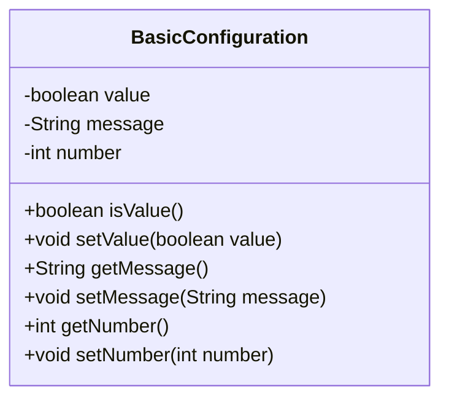
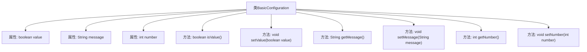

# 基础信息

|      |      |
|------|------|
| 名称 | BasicConfiguration |
| 编码语言 | .java |
| 代码路径 | spring-boot-examples/spring-boot-tutorial-basics-configuration/src/main/java/com/in28minutes/springboot/tutorial/basics/application/configuration/BasicConfiguration.java |
| 包名 | com.in28minutes.springboot.tutorial.basics.application.configuration |
| 依赖项 | ['org.springframework.boot.context.properties.ConfigurationProperties', 'org.springframework.stereotype.Component'] |
| 概述说明 | BasicConfiguration类包含布尔、字符串和整型属性配置。 |

# 说明

BasicConfiguration类用于配置多种类型的属性，包括布尔值、字符串和整型。这些属性涵盖了不同的数据类型，使得该类能够灵活地处理各种配置需求。通过设置布尔值属性，可以控制开关状态；字符串属性用于存储文本信息；整型属性则用于表示数值数据。该类的设计旨在提供一个统一的接口来管理和访问这些配置属性，确保代码的可维护性和扩展性。

# 类列表 Class Summary

| 名称   | 类型  | 说明 |
|-------|------|-------------|
| BasicConfiguration | class | BasicConfiguration类配置了布尔值、字符串和整型属性。 |

## 类 BasicConfiguration

|      |      |
|------|------|
| 访问范围 | @Component;@ConfigurationProperties("basic");public |
| 类型 | class |
| 名称 | BasicConfiguration |
| 说明 | BasicConfiguration类配置了布尔值、字符串和整型属性。 |

### UML类图

**描述：**  
`BasicConfiguration` 类是一个配置类，用于管理应用程序的基本配置属性。它包含三个私有字段：`value`（布尔类型）、`message`（字符串类型）和 `number`（整数类型），并提供了相应的 getter 和 setter 方法。通过 `@ConfigurationProperties` 注解，该类可以从配置文件中加载属性值，方便在应用程序中进行统一管理和使用。

### 内部方法调用关系图

这段代码定义了一个名为 `BasicConfiguration` 的类，该类使用了 `@Component` 和 `@ConfigurationProperties("basic")` 注解，表明它是一个Spring组件，并且其属性可以从配置文件中注入。类中包含三个私有属性：`value`、`message` 和 `number`，并为每个属性提供了对应的getter和setter方法。这些方法用于获取和设置属性的值。

### 字段列表 Field List

| 名称  | 类型  | 说明 |
|-------|-------|------|
| value | boolean | 声明一个私有的布尔类型变量value。 |
| number | int | 私有整型变量number。 |
| message | String | 声明了一个私有字符串变量message。 |

### 方法列表 Method List

| 名称  | 类型  | 说明 |
|-------|-------|------|
| setMessage | void | 定义方法设置消息内容。 |
| getMessage | String | 获取消息内容的方法。 |
| isValue | boolean | 该方法返回布尔值变量`value`的状态。 |
| getNumber | int | 方法getNumber返回整数类型变量number的值。 |
| setNumber | void | 设置类中整型变量number的值。 |
| setValue | void | 设置布尔类型变量值的方法。 |

