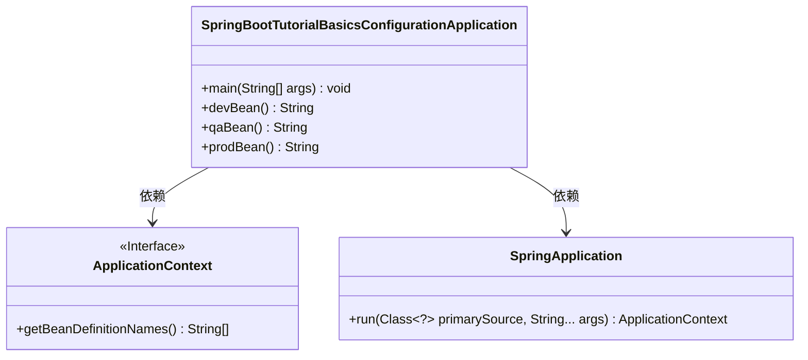
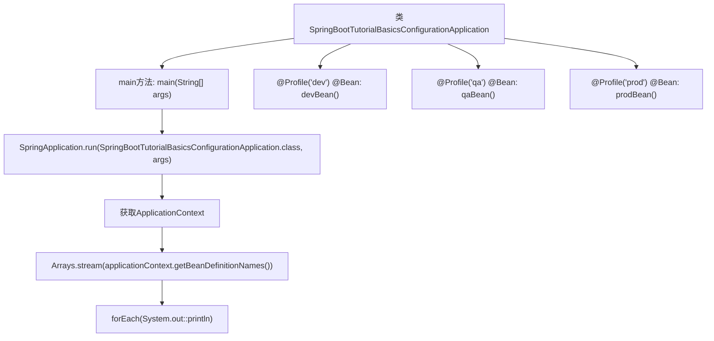

# 基础信息

|      |      |
|------|------|
| 名称 | SpringBootTutorialBasicsConfigurationApplication |
| 编码语言 | .java |
| 代码路径 | spring-boot-examples/spring-boot-tutorial-basics-configuration/src/main/java/com/in28minutes/springboot/tutorial/basics/application/configuration/SpringBootTutorialBasicsConfigurationApplication.java |
| 包名 | com.in28minutes.springboot.tutorial.basics.application.configuration |
| 依赖项 | ['java.util.Arrays', 'org.springframework.boot.SpringApplication', 'org.springframework.boot.autoconfigure.SpringBootApplication', 'org.springframework.context.ApplicationContext', 'org.springframework.context.annotation.Bean', 'org.springframework.context.annotation.Profile'] |
| 概述说明 | Spring Boot应用配置示例，支持多环境Bean定义。 |

# 说明

Spring Boot应用配置示例展示了如何在不同环境中定义Bean。该配置通过区分开发、测试和生产环境，确保应用在不同阶段使用相应的Bean实例。开发环境配置适用于本地调试，测试环境配置用于单元测试和集成测试，生产环境配置则优化了性能和安全性。通过这种灵活的环境配置，Spring Boot应用能够根据运行环境自动加载合适的Bean，提升应用的适应性和可维护性。

# 类列表 Class Summary

| 名称   | 类型  | 说明 |
|-------|------|-------------|
| SpringBootTutorialBasicsConfigurationApplication | class | Spring Boot应用配置示例，包含不同环境Bean定义。 |

## 类 SpringBootTutorialBasicsConfigurationApplication

|      |      |
|------|------|
| 访问范围 | @SpringBootApplication;public |
| 类型 | class |
| 名称 | SpringBootTutorialBasicsConfigurationApplication |
| 说明 | Spring Boot应用配置示例，包含不同环境Bean定义。 |

### UML类图

这段代码是一个Spring Boot应用程序的配置类，它通过`@SpringBootApplication`注解标记为Spring Boot应用。`main`方法启动应用并获取`ApplicationContext`，然后打印所有Bean的名称。类中还定义了三个带有不同`@Profile`注解的Bean方法，分别用于开发、测试和生产环境。代码展示了Spring Boot应用的基本配置和启动流程。

### 内部方法调用关系图

这段代码是一个Spring Boot应用程序的配置类，包含了主方法和三个根据不同Profile生成的Bean。主方法通过`SpringApplication.run`启动Spring Boot应用，并获取应用上下文，然后遍历并打印所有Bean的名称。根据不同的Profile（dev、qa、prod），会生成相应的Bean。流程图展示了类的结构、主方法的执行流程以及Bean的生成过程。

### 字段列表 Field List

| 名称  | 类型  | 说明 |
|-------|-------|------|

### 方法列表 Method List

| 名称  | 类型  | 说明 |
|-------|-------|------|
| devBean | String | 定义开发环境的Bean，返回字符串"dev"。 |
| prodBean | String | 生产环境配置Bean，返回"prod"。 |
| main | void | Spring Boot启动应用，打印所有Bean定义名称。 |
| qaBean | String | 定义一个名为qaBean的Bean，返回字符串"qa"。 |

