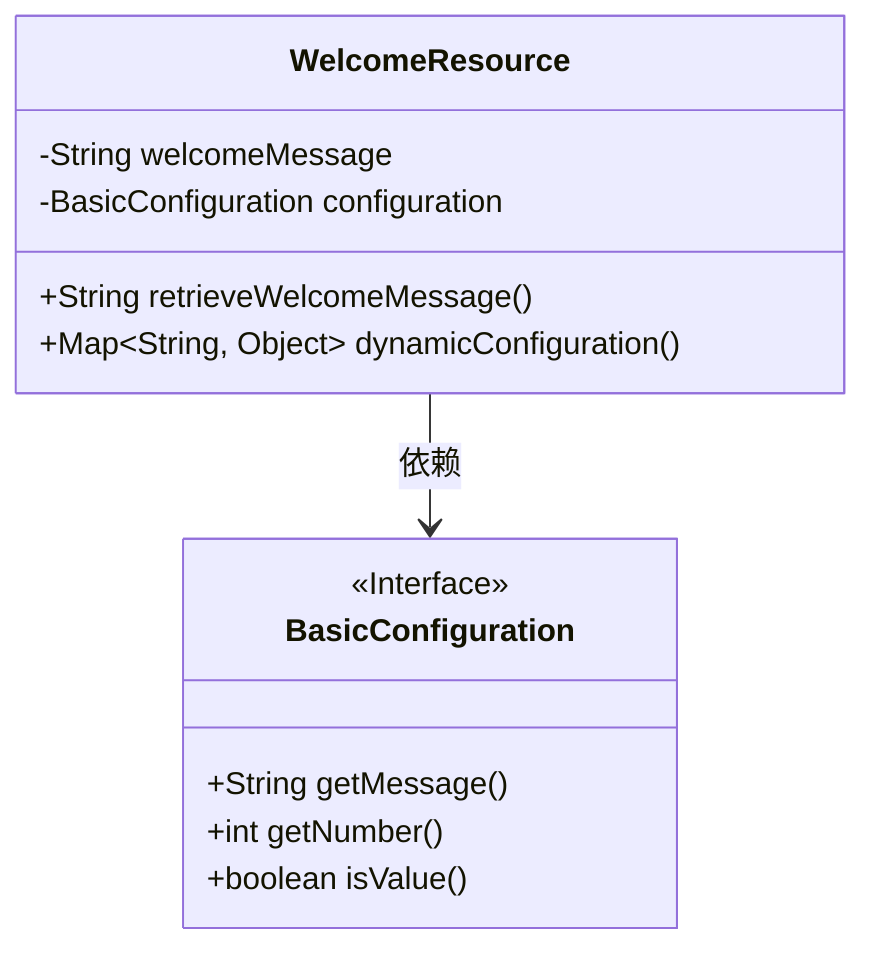
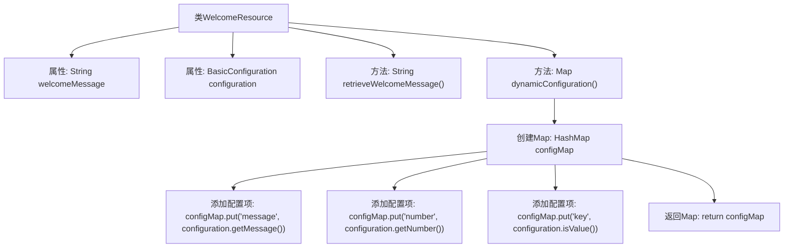

# 基础信息

|      |      |
|------|------|
| 名称 | WelcomeResource |
| 编码语言 | .java |
| 代码路径 | spring-boot-examples/spring-boot-tutorial-basics-configuration/src/main/java/com/in28minutes/springboot/tutorial/basics/application/configuration/WelcomeResource.java |
| 包名 | com.in28minutes.springboot.tutorial.basics.application.configuration |
| 依赖项 | ['java.util.HashMap', 'java.util.Map', 'org.springframework.beans.factory.annotation.Autowired', 'org.springframework.beans.factory.annotation.Value', 'org.springframework.web.bind.annotation.GetMapping', 'org.springframework.web.bind.annotation.RequestMapping', 'org.springframework.web.bind.annotation.RestController'] |
| 概述说明 | 欢迎资源控制器提供获取欢迎信息和动态配置的功能。 |

# 说明

欢迎资源控制器是一个包含获取欢迎信息和动态配置方法的组件。它负责处理和提供与欢迎信息相关的数据，同时支持动态配置的获取和更新，确保系统能够灵活响应配置变化。该控制器简化了欢迎信息和配置的管理，提高了系统的可维护性和扩展性。

# 类列表 Class Summary

| 名称   | 类型  | 说明 |
|-------|------|-------------|
| WelcomeResource | class | 欢迎资源控制器包含获取欢迎信息和动态配置的方法。 |

## 类 WelcomeResource

|      |      |
|------|------|
| 访问范围 | @RestController;public |
| 类型 | class |
| 名称 | WelcomeResource |
| 说明 | 欢迎资源控制器包含获取欢迎信息和动态配置的方法。 |

### UML类图

类图描述：
`WelcomeResource` 类是一个 Spring Boot 控制器，用于处理 HTTP 请求。它依赖于 `BasicConfiguration` 接口来获取配置信息。`WelcomeResource` 类包含两个主要方法：`retrieveWelcomeMessage` 用于返回欢迎消息，`dynamicConfiguration` 用于返回动态配置信息。`BasicConfiguration` 接口定义了获取配置信息的方法。

### 内部方法调用关系图

**描述：**
该流程图展示了`WelcomeResource`类的结构和主要方法调用关系。类中包含两个属性：`welcomeMessage`和`configuration`，以及两个方法：`retrieveWelcomeMessage()`和`dynamicConfiguration()`。`dynamicConfiguration()`方法创建了一个`HashMap`，并将`configuration`对象中的三个属性值添加到`Map`中，最后返回该`Map`。流程图清晰地展示了方法的执行顺序和数据的流向。

### 字段列表 Field List

| 名称  | 类型  | 说明 |
|-------|-------|------|
| welcomeMessage | String | 使用Spring注解注入欢迎消息配置值。 |
| configuration | BasicConfiguration | 自动注入BasicConfiguration配置类实例。 |

### 方法列表 Method List

| 名称  | 类型  | 说明 |
|-------|-------|------|
| dynamicConfiguration | Map<String, Object> | 动态配置接口返回包含消息、数字和键值对的映射。 |
| retrieveWelcomeMessage | String | Get请求方法返回欢迎信息。 |

