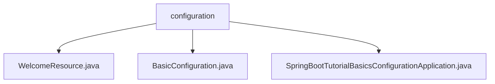

# 基础信息

|      |      |
|------|------|
| 名称 | configuration |
| 编码语言 | .java |
| 代码路径 | spring-boot-examples/spring-boot-tutorial-basics-configuration/src/main/java/com/in28minutes/springboot/tutorial/basics/application/configuration |
| 包名 | spring-boot-examples.spring-boot-tutorial-basics-configuration.src.main.java.com.in28minutes.springboot.tutorial.basics.application.configuration |
| 概述说明 | 欢迎资源控制器处理欢迎信息和动态配置，BasicConfiguration类管理多种属性，Spring Boot示例展示环境配置。 |

# 说明

## 概述

该代码模块是一个基于Spring Boot的应用配置示例，主要展示了如何在不同环境中定义和管理配置属性。模块的核心功能包括欢迎信息的获取与动态配置的管理，以及多种类型属性的配置。通过灵活的配置机制，该模块能够适应不同的运行环境（如开发、测试和生产），并确保应用的可维护性和扩展性。

## 主要业务场景

1. **欢迎信息管理**：
   - `WelcomeResource` 控制器负责处理和提供与欢迎信息相关的数据。它支持动态配置的获取和更新，确保系统能够灵活响应配置变化，简化了欢迎信息和配置的管理。

2. **多类型属性配置**：
   - `BasicConfiguration` 类用于配置多种类型的属性，包括布尔值、字符串和整型。这些属性涵盖了不同的数据类型，使得该类能够灵活地处理各种配置需求。通过统一的接口管理和访问这些配置属性，确保代码的可维护性和扩展性。

3. **环境区分配置**：
   - `SpringBootTutorialBasicsConfigurationApplication` 类展示了如何在不同环境中定义Bean。通过区分开发、测试和生产环境，确保应用在不同阶段使用相应的Bean实例。这种灵活的环境配置提升了应用的适应性和可维护性，优化了性能和安全性。

### 包内部结构视图

该流程图展示了`configuration`目录下的文件层级关系。`configuration`作为根节点，包含了三个文件：`WelcomeResource.java`、`BasicConfiguration.java`和`SpringBootTutorialBasicsConfigurationApplication.java`。这些文件都直接位于`configuration`目录下，没有进一步的子目录结构。

# 文件列表 File List

| 名称   | 类型  | 说明 |
|-------|------|-------------|
| [SpringBootTutorialBasicsConfigurationApplication.java](SpringBootTutorialBasicsConfigurationApplication.md) | file | Spring Boot应用配置示例，支持多环境Bean定义。 |
| [BasicConfiguration.java](BasicConfiguration.md) | file | BasicConfiguration类包含布尔、字符串和整型属性配置。 |
| [WelcomeResource.java](WelcomeResource.md) | file | 欢迎资源控制器提供获取欢迎信息和动态配置的功能。 |

