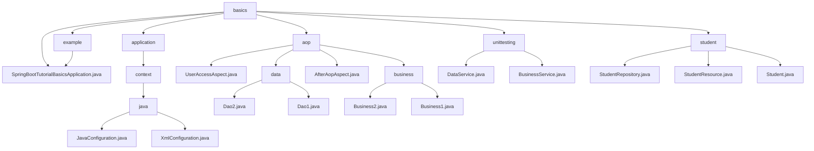

# 基础信息

|      |      |
|------|------|
| 名称 | in28minutes |
| 编码语言 | .java |
| 代码路径 | spring-boot-examples/spring-boot-tutorial-basics/src/main/java/com/in28minutes |
| 包名 | spring-boot-examples.spring-boot-tutorial-basics.src.main.java.com.in28minutes |
| 概述说明 | Spring Boot自动扫描加载Bean，打印名称便于调试。支持Java和XML配置，实现灵活管理。分层设计分离业务与数据，AOP增强功能。数据获取与处理模块化，提升效率。学生信息管理系统处理HTTP请求与数据持久化。 |

# 说明

## 概述

该代码模块是一个基于Spring Boot的综合应用，涵盖了配置管理、业务逻辑处理、数据访问、AOP（面向切面编程）、单元测试以及学生信息管理等多个方面。模块通过分层设计和模块化开发，确保了代码的可维护性、可扩展性和灵活性。Spring Boot的自动配置和依赖注入机制贯穿整个模块，简化了开发流程，同时提供了强大的调试和监控能力。

## 主要业务场景

1. **配置管理**：
   - **Java配置类管理Bean**：通过`JavaConfiguration`类，使用Java注解定义和管理Bean，确保配置的集中化和代码的可维护性。
   - **XML配置文件与注解结合**：通过`XmlConfiguration`类，结合`@ImportResource`注解导入XML配置文件，灵活地管理Bean，适用于与遗留系统集成或复杂配置场景。

2. **业务逻辑处理与数据访问**：
   - **数据检索**：`Dao1` 和 `Dao2` 类提供数据访问接口，适用于从数据源中获取特定信息的场景。
   - **业务逻辑处理**：`Business1` 和 `Business2` 类处理业务规则，调用数据访问类执行查询、插入、更新或删除等操作。
   - **关键信息提取**：`BusinessService` 类通过调用`DataService`获取数据，并从中筛选出最大值，适用于从大量数据中提取关键信息的场景。

3. **AOP（面向切面编程）**：
   - **用户访问权限检查**：`UserAccessAspect` 类在方法执行前进行用户访问权限检查，确保只有授权用户可以访问特定数据。
   - **方法执行后日志记录**：`AfterAopAspect` 类在方法执行后记录返回值和执行结果，便于后续分析和调试。
   - **日志记录**：`Business1` 类在数据访问过程中进行日志记录，确保操作的可追溯性和系统的可维护性。

4. **学生信息管理**：
   - **学生信息管理**：`Student` 类用于创建和管理学生对象，包含ID、姓名和护照号等属性。
   - **数据持久化**：`StudentRepository` 类负责学生数据的存储和检索，提供数据持久化支持。
   - **HTTP请求处理**：`StudentResource` 控制器类处理与学生相关的HTTP请求，特别是通过GET请求获取所有学生信息的功能，客户端可以通过该端点查询并展示学生数据的完整列表。

5. **单元测试**：
   - **单元测试**：模块中包含对各个组件的单元测试，确保每个组件的功能正确性和稳定性。

通过这些业务场景，该模块展示了Spring Boot在配置管理、业务逻辑处理、数据访问、AOP、单元测试以及学生信息管理等方面的强大能力，适用于构建复杂的企业级应用。

### 包内部结构视图

该流程图展示了Spring Boot教程基础示例项目的目录结构。从`basics`节点开始，分为多个子节点，包括`example`、`application`、`aop`、`unittesting`和`student`。每个子节点进一步细化为具体的文件或目录，如`SpringBootTutorialBasicsApplication.java`、`JavaConfiguration.java`、`UserAccessAspect.java`等。整个结构清晰地反映了项目的模块化和功能划分。

# 文件列表 File List

| 名称   | 类型  | 说明 |
|-------|------|-------------|
| [springboot](springboot/_module.md) | package | Spring Boot自动扫描加载Bean，打印名称便于调试。支持Java和XML配置，实现灵活管理。分层设计分离业务与数据，AOP增强功能。数据获取与处理模块化，提升效率。学生信息管理系统处理HTTP请求与数据持久化。 |

