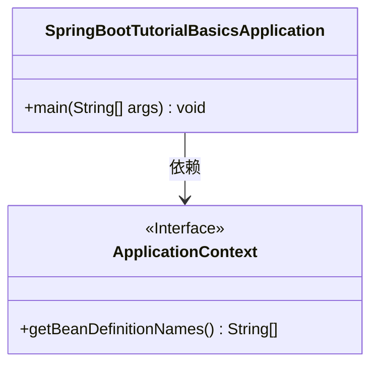
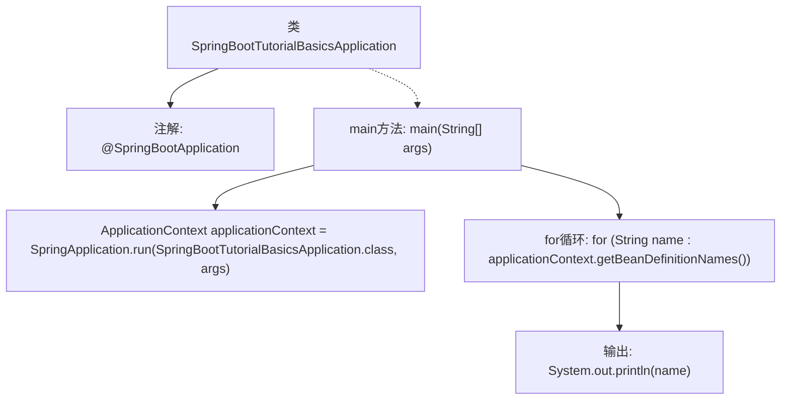

# 基础信息

|      |      |
|------|------|
| 名称 | SpringBootTutorialBasicsApplication |
| 编码语言 | .java |
| 代码路径 | spring-boot-examples/spring-boot-tutorial-basics/src/main/java/com/in28minutes/springboot/tutorial/basics/example/SpringBootTutorialBasicsApplication.java |
| 包名 | com.in28minutes.springboot.tutorial.basics.example |
| 依赖项 | ['org.springframework.boot.SpringApplication', 'org.springframework.boot.autoconfigure.SpringBootApplication', 'org.springframework.context.ApplicationContext'] |
| 概述说明 | Spring Boot启动时输出所有Bean名称。 |

# 说明

Spring Boot应用启动时会自动扫描并加载所有配置的Bean，这些Bean包括由Spring框架管理的各种组件、服务和控制器等。启动过程中，Spring Boot会将这些Bean的名称打印到控制台，方便开发者查看和调试。这一功能有助于开发者了解应用中所有已注册的Bean，确保依赖注入和配置的正确性。通过打印Bean名称，开发者可以快速识别和解决潜在的配置问题，提升应用的稳定性和可维护性。

# 类列表 Class Summary

| 名称   | 类型  | 说明 |
|-------|------|-------------|
| SpringBootTutorialBasicsApplication | class | Spring Boot应用启动并打印所有Bean名称。 |

## 类 SpringBootTutorialBasicsApplication

|      |      |
|------|------|
| 访问范围 | @SpringBootApplication;public |
| 类型 | class |
| 名称 | SpringBootTutorialBasicsApplication |
| 说明 | Spring Boot应用启动并打印所有Bean名称。 |

### UML类图

这段代码是一个简单的Spring Boot应用程序的入口类。`SpringBootTutorialBasicsApplication`类包含一个`main`方法，该方法启动Spring Boot应用程序并获取应用上下文。通过`ApplicationContext`接口，代码遍历并打印出所有在Spring容器中注册的Bean的名称。该代码展示了Spring Boot的基本启动流程和Bean的管理机制。

### 内部方法调用关系图

这段代码是一个Spring Boot应用程序的入口类，使用`@SpringBootApplication`注解标记。`main`方法启动Spring应用上下文，并通过`applicationContext.getBeanDefinitionNames()`获取所有Bean的名称，然后逐个打印出来。流程图展示了从类定义到启动应用上下文，再到遍历并输出Bean名称的完整流程。

### 字段列表 Field List

| 名称  | 类型  | 说明 |
|-------|-------|------|

### 方法列表 Method List

| 名称  | 类型  | 说明 |
|-------|-------|------|
| main | void | Spring Boot启动应用并打印所有Bean名称。 |

