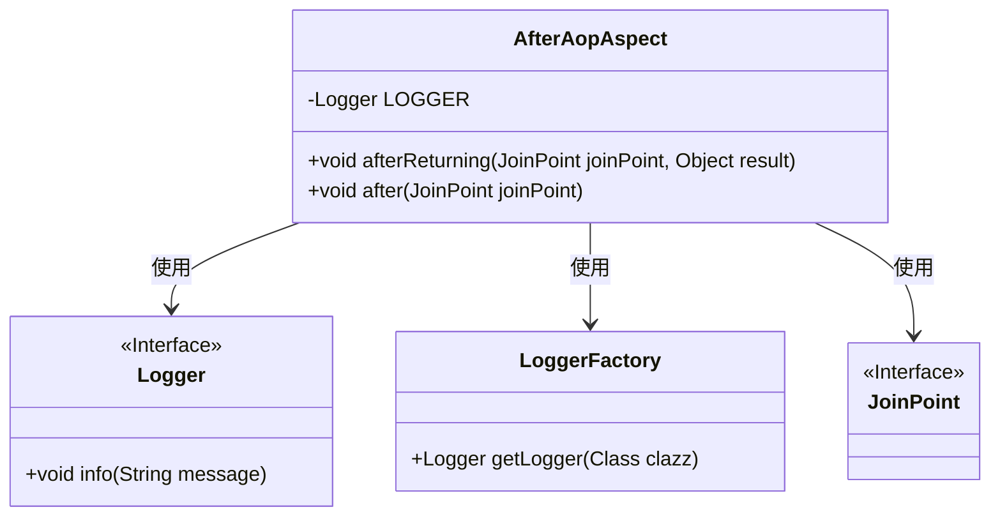
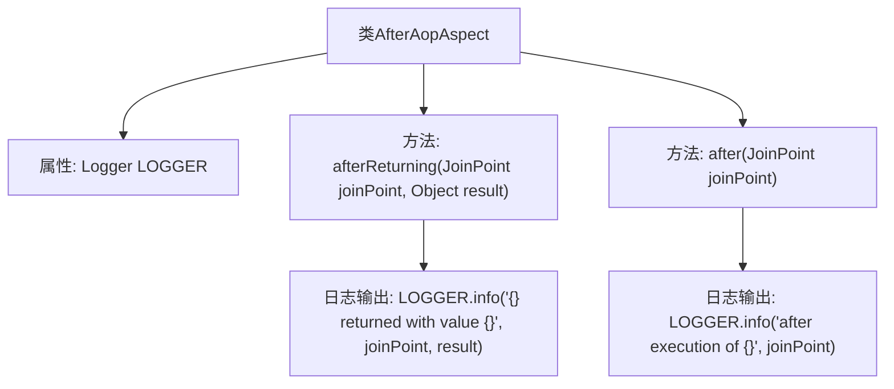

# 基础信息

|      |      |
|------|------|
| 名称 | AfterAopAspect |
| 编码语言 | .java |
| 代码路径 | spring-boot-examples/spring-boot-tutorial-basics/src/main/java/com/in28minutes/springboot/tutorial/basics/example/aop/AfterAopAspect.java |
| 包名 | com.in28minutes.springboot.tutorial.basics.example.aop |
| 依赖项 | ['org.aspectj.lang.JoinPoint', 'org.aspectj.lang.annotation.After', 'org.aspectj.lang.annotation.AfterReturning', 'org.aspectj.lang.annotation.Aspect', 'org.slf4j.Logger', 'org.slf4j.LoggerFactory', 'org.springframework.context.annotation.Configuration'] |
| 概述说明 | AfterAopAspect类记录AOP方法执行后的返回值和结果。 |

# 说明

AfterAopAspect类的主要功能是在AOP方法执行后记录其返回值和执行结果。该类通过捕获方法执行后的数据，实现对方法执行情况的监控和记录，便于后续分析和调试。

# 类列表 Class Summary

| 名称   | 类型  | 说明 |
|-------|------|-------------|
| AfterAopAspect | class | AfterAopAspect类用于记录AOP方法执行后的返回值和执行结果。 |

## 类 AfterAopAspect

|      |      |
|------|------|
| 访问范围 | @Aspect;@Configuration;public |
| 类型 | class |
| 名称 | AfterAopAspect |
| 说明 | AfterAopAspect类用于记录AOP方法执行后的返回值和执行结果。 |

### UML类图

类图描述：`AfterAopAspect` 类是一个 AOP 切面类，用于在方法执行后记录日志。它依赖于 `Logger` 接口来记录日志信息，并通过 `LoggerFactory` 获取 `Logger` 实例。`JoinPoint` 接口用于获取方法执行的上下文信息。该类包含两个方法：`afterReturning` 和 `after`，分别在方法返回后和执行后记录日志。

### 内部方法调用关系图

该流程图展示了`AfterAopAspect`类的结构及其内部方法的调用关系。类中包含一个`Logger`属性，以及两个方法`afterReturning`和`after`。`afterReturning`方法在目标方法成功返回后执行，并记录返回值和连接点信息；`after`方法在目标方法执行后执行，记录连接点信息。两个方法均通过`LOGGER`输出日志信息，确保在执行过程中能够跟踪和监控方法的执行情况。

### 字段列表 Field List

| 名称  | 类型  | 说明 |
|-------|-------|------|
| LOGGER = LoggerFactory.getLogger(this.getClass()) | Logger | 声明私有日志记录器并初始化。 |

### 方法列表 Method List

| 名称  | 类型  | 说明 |
|-------|-------|------|
| afterReturning | void | AOP切面方法在业务方法执行后记录返回值和执行点。 |
| after | void | 在业务类方法执行后记录日志信息。 |

