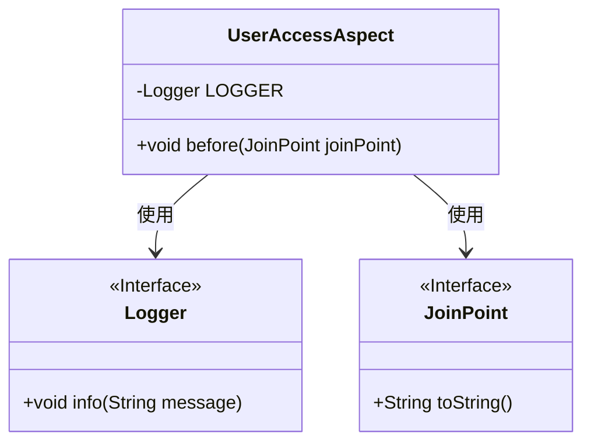
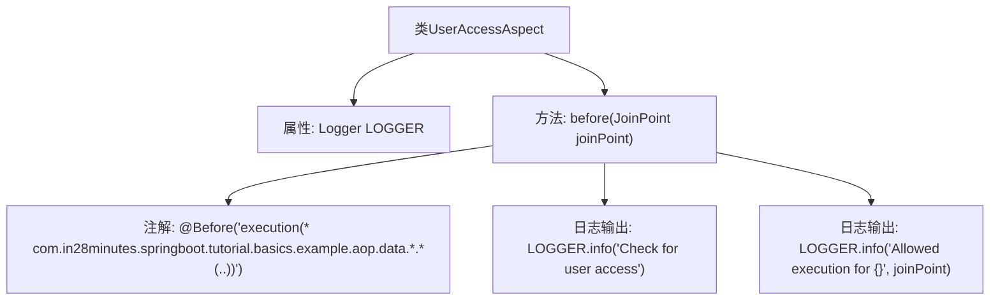

# 基础信息

|      |      |
|------|------|
| 名称 | UserAccessAspect |
| 编码语言 | .java |
| 代码路径 | spring-boot-examples/spring-boot-tutorial-basics/src/main/java/com/in28minutes/springboot/tutorial/basics/example/aop/UserAccessAspect.java |
| 包名 | com.in28minutes.springboot.tutorial.basics.example.aop |
| 依赖项 | ['org.aspectj.lang.JoinPoint', 'org.aspectj.lang.annotation.Aspect', 'org.aspectj.lang.annotation.Before', 'org.slf4j.Logger', 'org.slf4j.LoggerFactory', 'org.springframework.context.annotation.Configuration'] |
| 概述说明 | UserAccessAspect类拦截指定包下方法执行前检查用户权限。 |

# 说明

UserAccessAspect类负责在com.in28minutes.springboot.tutorial.basics.example.aop.data包下的所有方法执行前进行用户访问权限的检查。

# 类列表 Class Summary

| 名称   | 类型  | 说明 |
|-------|------|-------------|
| UserAccessAspect | class | UserAccessAspect类拦截com.in28minutes.springboot.tutorial.basics.example.aop.data包下的所有方法执行前检查用户访问权限。 |

## 类 UserAccessAspect

|      |      |
|------|------|
| 访问范围 | @Aspect;@Configuration;public |
| 类型 | class |
| 名称 | UserAccessAspect |
| 说明 | UserAccessAspect类拦截com.in28minutes.springboot.tutorial.basics.example.aop.data包下的所有方法执行前检查用户访问权限。 |

### UML类图

**描述：**
`UserAccessAspect` 是一个切面类，用于在方法执行前进行用户访问检查。它依赖于 `Logger` 接口记录日志信息，并使用 `JoinPoint` 接口获取方法执行的上下文信息。`before` 方法在目标方法执行前被调用，记录用户访问检查信息和允许执行的方法。

### 内部方法调用关系图

该流程图描述了`UserAccessAspect`类的结构和方法调用关系。`UserAccessAspect`类包含一个`Logger`属性和一个`before`方法，该方法使用`@Before`注解来拦截指定包下的所有方法调用。在方法执行前，会输出两条日志信息，分别用于检查用户访问权限和记录允许执行的方法调用。

### 字段列表 Field List

| 名称  | 类型  | 说明 |
|-------|-------|------|
| LOGGER = LoggerFactory.getLogger(this.getClass()) | Logger | 定义私有日志记录器实例，用于当前类的日志输出。 |

### 方法列表 Method List

| 名称  | 类型  | 说明 |
|-------|-------|------|
| before | void | 在AOP中，执行指定包方法前检查用户访问权限并记录日志。 |

