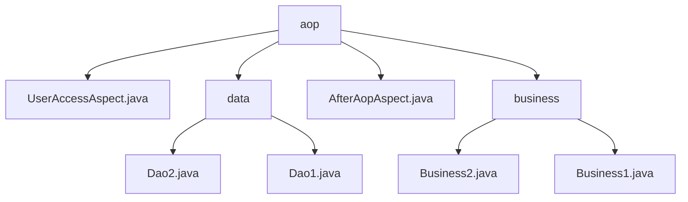

# 基础信息

|      |      |
|------|------|
| 名称 | aop |
| 编码语言 | .java |
| 代码路径 | spring-boot-examples/spring-boot-tutorial-basics/src/main/java/com/in28minutes/springboot/tutorial/basics/example/aop |
| 包名 | spring-boot-examples.spring-boot-tutorial-basics.src.main.java.com.in28minutes.springboot.tutorial.basics.example.aop |
| 概述说明 | UserAccessAspect类检查用户权限，Dao1和Dao2类提供数据检索，AfterAopAspect类记录方法执行结果，业务类处理逻辑并调用数据访问类。 |

# 说明

## 概述

该代码模块是一个基于Spring Boot的应用程序，主要实现了业务逻辑处理、数据访问操作以及AOP（面向切面编程）功能。模块采用了分层设计，将业务逻辑与数据访问分离，以提高代码的可维护性和可扩展性。此外，模块还通过AOP实现了用户访问权限检查、方法执行后的日志记录等功能，确保操作的透明性和可追溯性。

## 主要业务场景

1. **数据检索**：`Dao1` 和 `Dao2` 类提供了 `retrieveSomething` 方法，分别返回字符串 "Dao1" 和 "Dao2"，适用于需要从数据源中获取特定信息的场景。
2. **业务逻辑处理**：`Business1` 和 `Business2` 类负责处理业务规则和逻辑，并通过调用 `Dao1` 和 `Dao2` 类来与数据库或其他数据源进行交互，执行查询、插入、更新或删除等操作。
3. **用户访问权限检查**：`UserAccessAspect` 类在 `com.in28minutes.springboot.tutorial.basics.example.aop.data` 包下的所有方法执行前进行用户访问权限的检查，确保只有授权用户可以访问特定数据。
4. **方法执行后日志记录**：`AfterAopAspect` 类在AOP方法执行后记录其返回值和执行结果，便于后续分析和调试。
5. **日志记录**：`Business1` 类在调用 `Dao1` 类获取数据的过程中进行日志记录，确保操作的可追溯性和系统的可维护性。
6. **模块化设计**：通过将业务逻辑与数据访问分离，以及使用AOP进行权限检查和日志记录，代码模块化程度较高，便于维护和扩展。

### 包内部结构视图

该流程图展示了`aop`目录下的层级结构，`aop`作为根目录，包含了多个子目录和文件。`data`和`business`是`aop`下的两个子目录，分别包含了不同的Java文件。`UserAccessAspect.java`和`AfterAopAspect.java`直接位于`aop`目录下，而`Dao2.java`和`Dao1.java`位于`data`目录下，`Business2.java`和`Business1.java`位于`business`目录下。

# 文件列表 File List

| 名称   | 类型  | 说明 |
|-------|------|-------------|
| [AfterAopAspect.java](AfterAopAspect.md) | file | AfterAopAspect类记录AOP方法执行后的返回值和结果。 |
| [UserAccessAspect.java](UserAccessAspect.md) | file | UserAccessAspect类拦截指定包下方法执行前检查用户权限。 |
| [business](business/_module.md) | package | Business2类调用Dao2类进行数据访问，处理业务逻辑。Business1类调用Dao1类获取数据并记录日志。分层设计提升代码可维护性和可扩展性。 |
| [data](data/_module.md) | package | Dao2类提供数据检索，retrieveSomething方法返回"Dao2"。Dao1类通过retrieveSomething方法返回"Dao1"。 |

