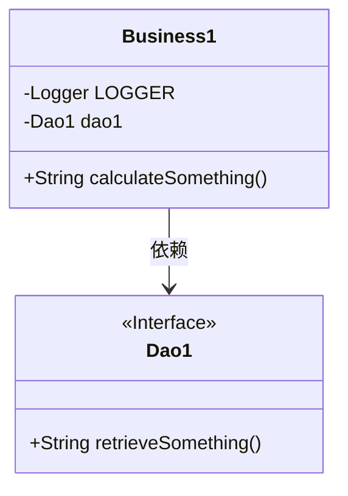
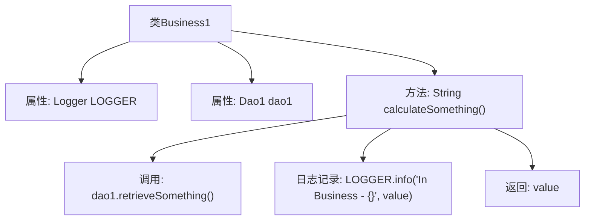

# 基础信息

|      |      |
|------|------|
| 名称 | Business1 |
| 编码语言 | .java |
| 代码路径 | spring-boot-examples/spring-boot-tutorial-basics/src/main/java/com/in28minutes/springboot/tutorial/basics/example/aop/business/Business1.java |
| 包名 | com.in28minutes.springboot.tutorial.basics.example.aop.business |
| 依赖项 | ['com.in28minutes.springboot.tutorial.basics.example.aop.data.Dao1', 'org.slf4j.Logger', 'org.slf4j.LoggerFactory', 'org.springframework.beans.factory.annotation.Autowired', 'org.springframework.stereotype.Service'] |
| 概述说明 | 业务类Business1通过Dao1获取数据并记录日志。 |

# 说明

业务类Business1通过调用Dao1来获取所需数据，并在数据获取过程中进行日志记录，以确保操作的透明性和可追溯性。这一流程涵盖了数据访问和日志记录两个关键环节，确保业务逻辑的完整性和系统的可维护性。

# 类列表 Class Summary

| 名称   | 类型  | 说明 |
|-------|------|-------------|
| Business1 | class | 业务类Business1使用Dao1获取数据并记录日志。 |

## 类 Business1

|      |      |
|------|------|
| 访问范围 | @Service;public |
| 类型 | class |
| 名称 | Business1 |
| 说明 | 业务类Business1使用Dao1获取数据并记录日志。 |

### UML类图

类图描述：`Business1` 类是一个服务类，依赖于 `Dao1` 接口。`Business1` 类中包含一个私有的 `Logger` 实例和一个私有的 `Dao1` 实例。`Business1` 类提供了一个公有方法 `calculateSomething()`，该方法调用 `Dao1` 接口的 `retrieveSomething()` 方法来获取数据，并使用 `Logger` 记录日志。`Dao1` 接口定义了一个公有方法 `retrieveSomething()`，用于检索数据。

### 内部方法调用关系图

这段代码展示了一个名为`Business1`的类，该类包含一个`calculateSomething`方法，用于执行业务逻辑。该方法首先通过`dao1`对象调用`retrieveSomething`方法获取一个值，然后使用`LOGGER`记录该值，并最终返回该值。流程图清晰地展示了类属性、方法调用以及日志记录和返回值的流程。

### 字段列表 Field List

| 名称  | 类型  | 说明 |
|-------|-------|------|
| LOGGER = LoggerFactory.getLogger(this.getClass()) | Logger | 定义私有日志记录器，用于当前类的日志输出。 |
| dao1 | Dao1 | 自动注入Dao1实例到当前类中。 |

### 方法列表 Method List

| 名称  | 类型  | 说明 |
|-------|-------|------|
| calculateSomething | String | 该方法从dao1获取数据并记录日志后返回。 |

