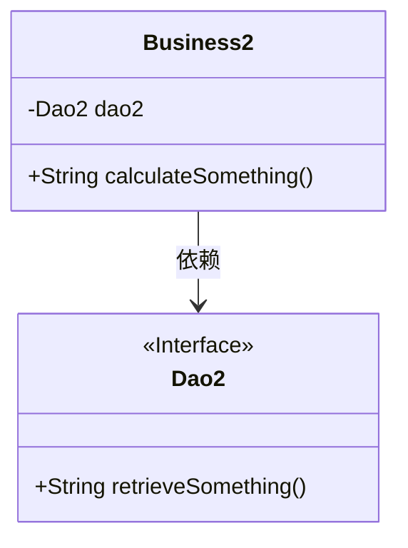
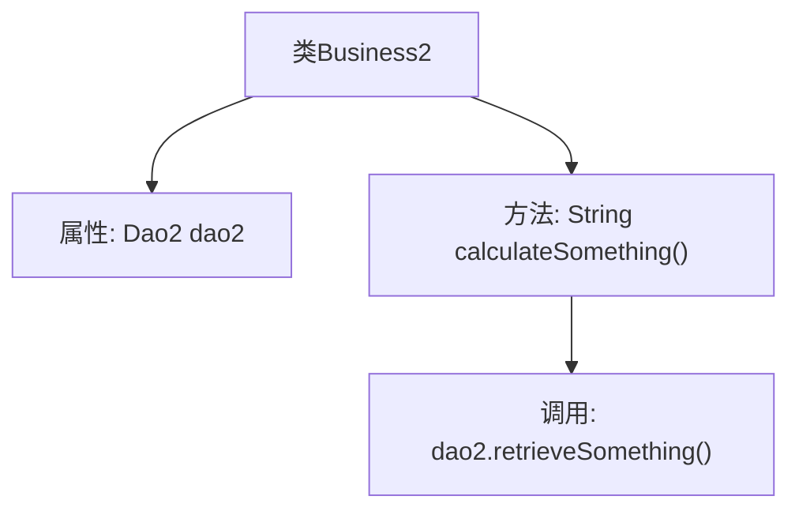

# 基础信息

|      |      |
|------|------|
| 名称 | Business2 |
| 编码语言 | .java |
| 代码路径 | spring-boot-examples/spring-boot-tutorial-basics/src/main/java/com/in28minutes/springboot/tutorial/basics/example/aop/business/Business2.java |
| 包名 | com.in28minutes.springboot.tutorial.basics.example.aop.business |
| 依赖项 | ['org.springframework.beans.factory.annotation.Autowired', 'org.springframework.stereotype.Service', 'com.in28minutes.springboot.tutorial.basics.example.aop.data.Dao2'] |
| 概述说明 | Business2类通过Dao2执行业务逻辑并返回结果。 |

# 说明

在业务逻辑实现中，Business2类通过调用Dao2类来完成数据访问操作。Dao2类负责与数据库或其他数据源进行交互，执行具体的查询、插入、更新或删除操作。Business2类则负责处理业务规则和逻辑，调用Dao2类获取所需数据，并根据业务需求进行进一步处理，最终返回处理结果。这种分层设计确保了业务逻辑与数据访问的分离，提高了代码的可维护性和可扩展性。

# 类列表 Class Summary

| 名称   | 类型  | 说明 |
|-------|------|-------------|
| Business2 | class | Business2类使用Dao2实现业务逻辑并返回结果。 |

## 类 Business2

|      |      |
|------|------|
| 访问范围 | @Service;public |
| 类型 | class |
| 名称 | Business2 |
| 说明 | Business2类使用Dao2实现业务逻辑并返回结果。 |

### UML类图

**描述：**  
`Business2` 类是一个服务类，依赖于 `Dao2` 接口。`Business2` 类中包含一个私有成员 `dao2`，并通过 `calculateSomething()` 方法调用 `Dao2` 接口的 `retrieveSomething()` 方法来实现业务逻辑。`Dao2` 是一个接口，定义了 `retrieveSomething()` 方法，具体的实现类未在代码中显示。

### 内部方法调用关系图

这段代码展示了一个Spring服务类`Business2`，它通过`@Autowired`注解注入了一个`Dao2`类型的依赖。`Business2`类中定义了一个`calculateSomething`方法，该方法执行一些业务逻辑后，调用`dao2`的`retrieveSomething`方法并返回其结果。流程图清晰地展示了类的结构及其内部方法的调用关系。

### 字段列表 Field List

| 名称  | 类型  | 说明 |
|-------|-------|------|
| dao2 | Dao2 | 自动注入Dao2实例。 |

### 方法列表 Method List

| 名称  | 类型  | 说明 |
|-------|-------|------|
| calculateSomething | String | 方法calculateSomething调用dao2.retrieveSomething并返回结果。 |

