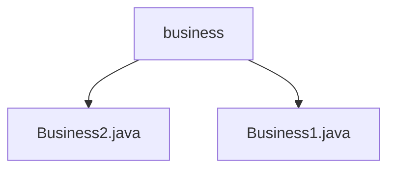

# 基础信息

|      |      |
|------|------|
| 名称 | business |
| 编码语言 | .java |
| 代码路径 | spring-boot-examples/spring-boot-tutorial-basics/src/main/java/com/in28minutes/springboot/tutorial/basics/example/aop/business |
| 包名 | spring-boot-examples.spring-boot-tutorial-basics.src.main.java.com.in28minutes.springboot.tutorial.basics.example.aop.business |
| 概述说明 | Business2类调用Dao2类进行数据访问，处理业务逻辑。Business1类调用Dao1类获取数据并记录日志。分层设计提升代码可维护性和可扩展性。 |

# 说明

## 概述
该代码模块主要实现了基于Spring Boot的业务逻辑处理和数据访问操作。模块采用了分层设计，将业务逻辑与数据访问分离，以提高代码的可维护性和可扩展性。业务类（如`Business1`和`Business2`）负责处理业务规则和逻辑，并通过调用数据访问类（如`Dao1`和`Dao2`）来与数据库或其他数据源进行交互。此外，模块还通过日志记录确保操作的透明性和可追溯性。

## 主要业务场景
1. **业务逻辑处理**：`Business2`类通过调用`Dao2`类完成数据访问操作，执行查询、插入、更新或删除等操作，并根据业务需求对数据进行进一步处理，最终返回处理结果。
2. **日志记录**：`Business1`类在调用`Dao1`类获取数据的过程中进行日志记录，确保操作的可追溯性和系统的可维护性。
3. **分层设计**：模块通过将业务逻辑与数据访问分离，确保代码结构清晰，便于维护和扩展。

### 包内部结构视图

该流程图展示了在`spring-boot-tutorial-basics`项目中的`business`文件夹与其包含的两个Java文件`Business2.java`和`Business1.java`之间的层级关系。`business`作为父节点，直接包含这两个文件，清晰地反映了项目结构中的依赖关系。

# 文件列表 File List

| 名称   | 类型  | 说明 |
|-------|------|-------------|
| [Business1.java](Business1.md) | file | 业务类Business1通过Dao1获取数据并记录日志。 |
| [Business2.java](Business2.md) | file | Business2类通过Dao2执行业务逻辑并返回结果。 |

