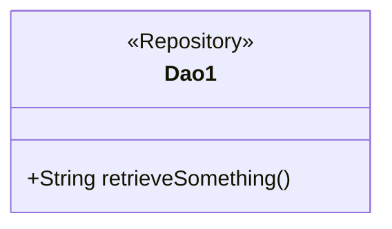
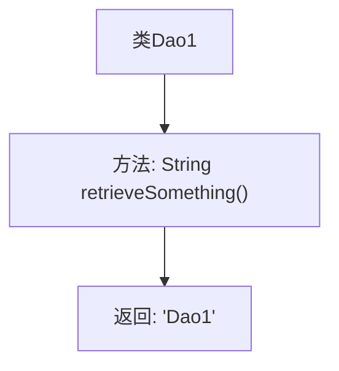

# 基础信息

|      |      |
|------|------|
| 名称 | Dao1 |
| 编码语言 | .java |
| 代码路径 | spring-boot-examples/spring-boot-tutorial-basics/src/main/java/com/in28minutes/springboot/tutorial/basics/example/aop/data/Dao1.java |
| 包名 | com.in28minutes.springboot.tutorial.basics.example.aop.data |
| 依赖项 | ['org.springframework.stereotype.Repository'] |
| 概述说明 | Dao1类的retrieveSomething方法返回"Dao1"字符串。 |

# 说明

Dao1类是一个包含特定方法的类，其核心功能通过retrieveSomething方法实现。该方法的主要作用是返回一个字符串，具体返回值为"Dao1"。这个设计表明Dao1类可能用于数据访问或处理，且retrieveSomething方法提供了某种形式的检索或获取功能。整体结构简洁，功能明确，适用于需要返回特定字符串的场景。

# 类列表 Class Summary

| 名称   | 类型  | 说明 |
|-------|------|-------------|
| Dao1 | class | Dao1类包含一个返回"Dao1"字符串的retrieveSomething方法。 |

## 类 Dao1

|      |      |
|------|------|
| 访问范围 | @Repository;public |
| 类型 | class |
| 名称 | Dao1 |
| 说明 | Dao1类包含一个返回"Dao1"字符串的retrieveSomething方法。 |

### UML类图

这段代码定义了一个名为 `Dao1` 的类，并使用了 `@Repository` 注解来标记该类为一个数据访问对象（DAO）。`Dao1` 类包含一个公有方法 `retrieveSomething()`，该方法返回一个字符串 "Dao1"。这个类的主要作用是提供数据访问的功能，通常用于与数据库或其他数据源进行交互。通过 `@Repository` 注解，Spring 框架可以自动扫描并管理该类的实例，方便在应用中进行依赖注入。

### 内部方法调用关系图

这段代码定义了一个名为`Dao1`的类，该类被标记为`@Repository`，表示它是一个数据访问对象（DAO）。类中包含一个名为`retrieveSomething`的方法，该方法返回字符串`"Dao1"`。流程图展示了类与方法的层级关系，以及方法的返回操作。

### 字段列表 Field List

| 名称  | 类型  | 说明 |
|-------|-------|------|

### 方法列表 Method List

| 名称  | 类型  | 说明 |
|-------|-------|------|
| retrieveSomething | String | 方法retrieveSomething返回字符串"Dao1"。 |

