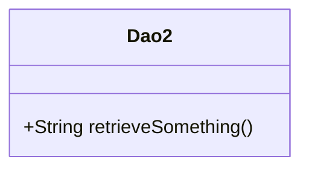
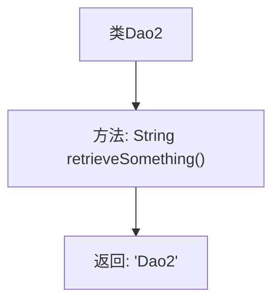

# 基础信息

|      |      |
|------|------|
| 名称 | Dao2 |
| 编码语言 | .java |
| 代码路径 | spring-boot-examples/spring-boot-tutorial-basics/src/main/java/com/in28minutes/springboot/tutorial/basics/example/aop/data/Dao2.java |
| 包名 | com.in28minutes.springboot.tutorial.basics.example.aop.data |
| 依赖项 | ['org.springframework.stereotype.Repository'] |
| 概述说明 | Dao2类用于数据访问，提供retrieveSomething方法返回"Dao2"。 |

# 说明

Dao2类是一个用于数据访问的类，主要功能是提供数据检索操作。该类包含一个名为retrieveSomething的方法，该方法在被调用时会返回字符串"Dao2"。这个类主要用于处理和访问数据，确保数据检索操作的高效性和准确性。通过retrieveSomething方法，用户可以方便地获取所需的数据信息。

# 类列表 Class Summary

| 名称   | 类型  | 说明 |
|-------|------|-------------|
| Dao2 | class | Dao2类用于数据访问，提供retrieveSomething方法返回"Dao2"。 |

## 类 Dao2

|      |      |
|------|------|
| 访问范围 | @Repository;public |
| 类型 | class |
| 名称 | Dao2 |
| 说明 | Dao2类用于数据访问，提供retrieveSomething方法返回"Dao2"。 |

### UML类图

这段代码定义了一个名为 `Dao2` 的类，该类包含一个公有方法 `retrieveSomething()`，该方法返回一个字符串 "Dao2"。`Dao2` 类被标记为 `@Repository`，表明它是一个数据访问对象（DAO），通常用于与数据库或其他持久化机制进行交互。类图中展示了 `Dao2` 类的结构，突出了其公有方法的定义。

### 内部方法调用关系图

这段代码定义了一个名为 `Dao2` 的类，该类包含一个 `retrieveSomething` 方法。该方法返回字符串 `"Dao2"`。流程图展示了类的结构以及方法与其返回值之间的关系，清晰地描述了类的内部逻辑和功能。

### 字段列表 Field List

| 名称  | 类型  | 说明 |
|-------|-------|------|

### 方法列表 Method List

| 名称  | 类型  | 说明 |
|-------|-------|------|
| retrieveSomething | String | 方法retrieveSomething返回字符串"Dao2"。 |

