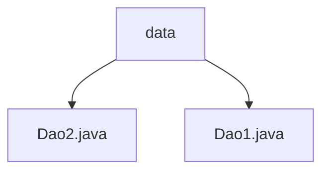

# 基础信息

|      |      |
|------|------|
| 名称 | data |
| 编码语言 | .java |
| 代码路径 | spring-boot-examples/spring-boot-tutorial-basics/src/main/java/com/in28minutes/springboot/tutorial/basics/example/aop/data |
| 包名 | spring-boot-examples.spring-boot-tutorial-basics.src.main.java.com.in28minutes.springboot.tutorial.basics.example.aop.data |
| 概述说明 | Dao2类提供数据检索，retrieveSomething方法返回"Dao2"。Dao1类通过retrieveSomething方法返回"Dao1"。 |

# 说明

## 概述

该代码模块包含两个数据访问类：`Dao1` 和 `Dao2`。这两个类的主要功能是提供数据检索操作，分别通过各自的 `retrieveSomething` 方法实现。这些类设计简洁，功能明确，适用于需要返回特定字符串的场景，确保数据检索操作的高效性和准确性。

## 主要业务场景

- **数据检索**：`Dao1` 和 `Dao2` 类均提供了 `retrieveSomething` 方法，分别返回字符串 "Dao1" 和 "Dao2"。这些方法适用于需要从数据源中获取特定信息的场景。
- **数据访问**：这两个类主要用于处理和访问数据，确保数据检索操作的高效性和准确性。通过调用 `retrieveSomething` 方法，用户可以方便地获取所需的数据信息。
- **模块化设计**：通过将数据访问逻辑封装在 `Dao1` 和 `Dao2` 类中，代码模块化程度较高，便于维护和扩展。

### 包内部结构视图

该流程图展示了路径 `data` 文件夹下的两个文件 `Dao2.java` 和 `Dao1.java` 的层级关系。`data` 作为父节点，包含了两个子节点 `Dao2.java` 和 `Dao1.java`，清晰地反映了文件在文件夹中的组织结构。

# 文件列表 File List

| 名称   | 类型  | 说明 |
|-------|------|-------------|
| [Dao1.java](Dao1.md) | file | Dao1类的retrieveSomething方法返回"Dao1"字符串。 |
| [Dao2.java](Dao2.md) | file | Dao2类用于数据访问，提供retrieveSomething方法返回"Dao2"。 |

