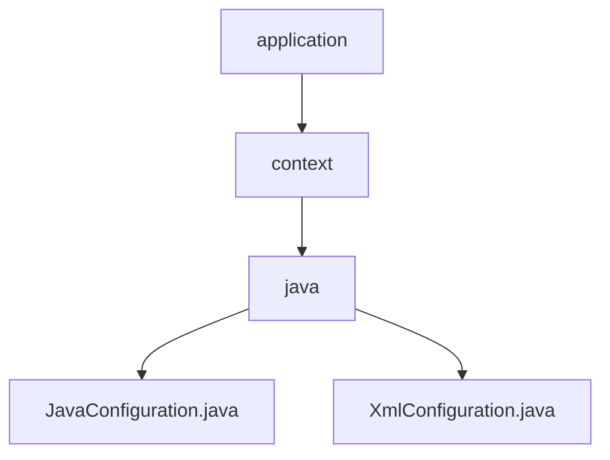

# 基础信息

|      |      |
|------|------|
| 名称 | application |
| 编码语言 | .java |
| 代码路径 | spring-boot-examples/spring-boot-tutorial-basics/src/main/java/com/in28minutes/springboot/tutorial/basics/example/application |
| 包名 | spring-boot-examples.spring-boot-tutorial-basics.src.main.java.com.in28minutes.springboot.tutorial.basics.example.application |
| 概述说明 | Java配置类定义两个Bean，XmlConfiguration导入XML配置文件。 |

# 说明

## 概述

该代码模块主要涉及Spring Boot应用中的配置管理，通过Java配置类和XML配置文件两种方式，实现了Bean的定义和加载。模块中的两个主要类分别是`JavaConfiguration`和`XmlConfiguration`，它们分别通过Java注解和XML文件来管理Spring应用上下文中的Bean。这些配置方式确保了应用的可配置性、模块化和可维护性，使开发者能够灵活地管理和替换Bean，以满足不同的应用需求。

## 主要业务场景

1. **Java配置类管理Bean**：在`JavaConfiguration`类中，定义了两个Bean（`someDummyBean1`和`someDummyBean2`），并通过配置类进行初始化和管理。这种方式适用于需要在代码中直接定义和配置Bean的场景，确保了配置的集中化和代码的可维护性。

2. **XML配置文件与注解结合**：在`XmlConfiguration`类中，通过`@ImportResource`注解导入了`applicationContext.xml`配置文件，将XML中定义的Bean加载到Spring应用上下文中。这种方式适用于需要将传统的XML配置与基于注解的配置结合使用的场景，提供了更高的配置灵活性，特别是在需要与遗留系统集成或使用复杂配置时。

通过这些配置方式，开发者可以根据具体需求选择最适合的配置方法，确保应用的灵活性和可扩展性。

### 包内部结构视图

该流程图展示了Spring Boot教程基础示例中应用程序上下文的层级关系。`application`文件夹包含`context`子文件夹，`context`文件夹进一步包含`java`子文件夹，`java`文件夹中包含了`JavaConfiguration.java`和`XmlConfiguration.java`两个配置文件。这种结构清晰地反映了代码的组织方式。

# 文件列表 File List

| 名称   | 类型  | 说明 |
|-------|------|-------------|
| [context](context/_module.md) | package | Java配置类定义两个Bean，XmlConfiguration导入XML配置文件。 |

