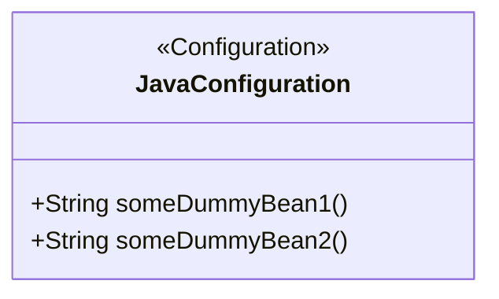
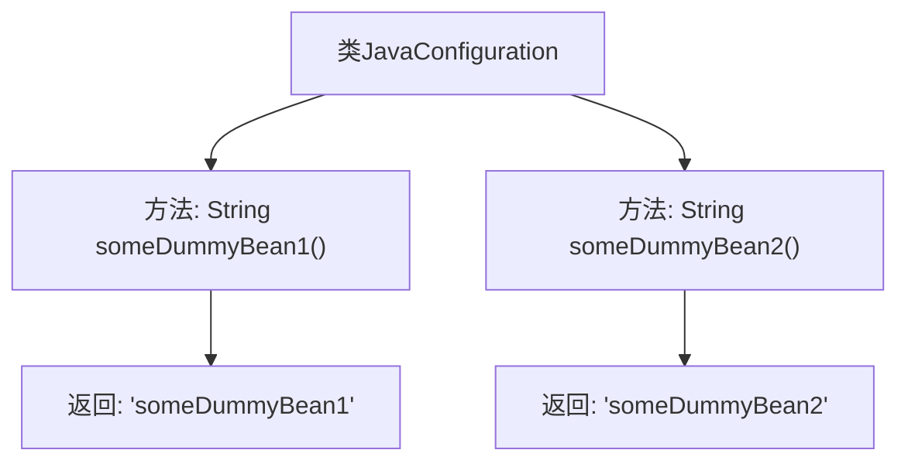

# 基础信息

|      |      |
|------|------|
| 名称 | JavaConfiguration |
| 编码语言 | .java |
| 代码路径 | spring-boot-examples/spring-boot-tutorial-basics/src/main/java/com/in28minutes/springboot/tutorial/basics/example/application/context/java/JavaConfiguration.java |
| 包名 | com.in28minutes.springboot.tutorial.basics.example.application.context.java |
| 依赖项 | ['org.springframework.context.annotation.Bean', 'org.springframework.context.annotation.Configuration'] |
| 概述说明 | Java配置类定义了两个Bean：someDummyBean1和someDummyBean2。 |

# 说明

在Java配置类中定义了两个Bean，分别是someDummyBean1和someDummyBean2。这两个Bean通过配置类进行初始化和管理，用于在应用程序中提供特定的功能或服务。配置类通常用于集中管理Bean的创建和依赖注入，确保代码的模块化和可维护性。通过这种方式，开发者可以灵活地配置和替换Bean，以满足不同的应用需求。

# 类列表 Class Summary

| 名称   | 类型  | 说明 |
|-------|------|-------------|
| JavaConfiguration | class | Java配置类定义了两个Bean：someDummyBean1和someDummyBean2。 |

## 类 JavaConfiguration

|      |      |
|------|------|
| 访问范围 | @Configuration;public |
| 类型 | class |
| 名称 | JavaConfiguration |
| 说明 | Java配置类定义了两个Bean：someDummyBean1和someDummyBean2。 |

### UML类图

这段代码定义了一个名为 `JavaConfiguration` 的配置类，使用了 Spring 框架的 `@Configuration` 注解。该类中包含两个方法 `someDummyBean1` 和 `someDummyBean2`，分别使用 `@Bean` 注解标记，表示这两个方法将返回 Spring 容器中的 Bean 实例。`someDummyBean1` 方法返回字符串 `"someDummyBean1"`，而 `someDummyBean2` 方法返回字符串 `"someDummyBean2"`。这个类的主要作用是配置 Spring 容器中的 Bean 实例。

### 内部方法调用关系图

这段代码定义了一个名为 `JavaConfiguration` 的配置类，其中包含两个被 `@Bean` 注解标记的方法 `someDummyBean1` 和 `someDummyBean2`。这两个方法分别返回字符串 `"someDummyBean1"` 和 `"someDummyBean2"`，这些字符串将被注册为 Spring 容器中的 Bean。流程图展示了类的结构以及方法之间的调用关系，清晰地描述了每个方法的返回值和它们与类的关系。

### 字段列表 Field List

| 名称  | 类型  | 说明 |
|-------|-------|------|

### 方法列表 Method List

| 名称  | 类型  | 说明 |
|-------|-------|------|
| someDummyBean1 | String | 定义了一个返回字符串"someDummyBean1"的Bean方法。 |
| someDummyBean2 | String | 定义了一个返回"someDummyBean2"的Spring Bean。 |

